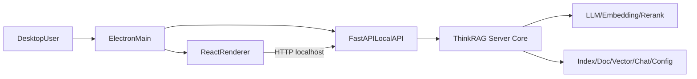

# ThinkRAG 桌面化项目设计文档

## 1. 文档目标

本文档用于固化 ThinkRAG 从 Streamlit Web 形态迁移到 Electron + React 桌面形态后的整体设计，覆盖架构、模块边界、数据流、关键接口、发布流程与后续演进方向，便于团队协作与回归维护。

## 2. 设计原则

- 本地优先：所有核心能力可在本机离线或弱网环境执行。
- 分层清晰：桌面壳、前端 UI、后端 API、RAG 引擎职责边界明确。
- 向后兼容：保留原有 Python `server` 能力，减少核心算法重写风险。
- 可观测与可诊断：统一响应结构、健康检查、错误可读性与运行手册齐备。
- 渐进演进：先打通主链路，再逐步功能对齐与工程化发布。

## 3. 总体架构



## 4. 目录与模块职责

### 4.1 桌面壳

- `desktop/src/main.js`：应用生命周期、窗口管理、加载前端地址。
- `desktop/src/python-process.js`：本地 Python API 子进程启动、健康检查、回收。
- `desktop/src/preload.js`：最小能力桥接，保证 Renderer 安全边界。
- `desktop/scripts/build-target.js`：按当前平台自动选择打包目标。

### 4.2 前端 UI

- `webapp/src/pages/*.jsx`：业务页面（Query、KB File、KB Web、KB Manage、Models、Storage、Advanced、Settings）。
- `webapp/src/api/*.js`：后端接口封装层。
- `webapp/src/store/appStore.js`：跨页会话状态（如 `sessionId`）。
- `webapp/src/components/ShellLayout.jsx`：导航与页面框架。

### 4.3 本地 API 层

- `api/app.py`：FastAPI 入口、路由装配、统一异常处理。
- `api/routers/*.py`：协议层（参数解析、状态码转换）。
- `api/services/*.py`：业务编排层（聊天、知识库、模型、设置、存储）。
- `api/runtime.py`：运行时上下文与懒加载依赖（IndexManager、查询引擎）。

### 4.4 RAG 核心层

- `server/engine.py`：QueryEngine 构建。
- `server/index.py`：索引加载、构建、插入、删除。
- `server/models/*.py`：LLM、Embedding、Reranker 相关能力。
- `server/stores/*.py`：多类存储适配与持久化。

## 5. 关键业务流程

## 5.1 启动流程

1. Electron 启动并拉起 Python API 子进程。
2. 主进程通过 `/api/health` 轮询确认服务可用。
3. 可用后加载 React 页面并开放交互。

## 5.2 问答流程

1. 前端 `QueryPage` 调用 `POST /api/chat/query`。
2. API 层校验请求并进入 `chat_service`。
3. 运行时确保索引可用，构建 QueryEngine 执行检索与生成。
4. 返回统一响应结构，前端展示答案与来源。

## 5.3 知识库导入流程

### 文件导入

- `POST /api/kb/file/import` 接收文件 + 切块参数。
- 服务层落盘并触发 `IndexManager.load_files()` 构建索引。

### 网页导入

- `POST /api/kb/web/import` 接收 URL 列表。
- 服务层调用 `IndexManager.load_websites()`，支持正文提取与镜像兜底。

## 5.4 自定义模型站点接入流程

1. 在 `Models` 页填写 `name/api_base/api_key/models`。
2. 调用 `POST /api/model/providers` 保存自定义 provider。
3. 使用 `POST /api/model/providers/test` 进行连通测试。
4. 测试通过后选择 provider + model 调用 `POST /api/model/select` 应用。

## 6. 接口规范

统一响应结构：

```json
{
  "code": 0,
  "message": "ok",
  "data": {},
  "request_id": "uuid"
}
```

已实现核心接口：

- `GET /api/health`
- `POST /api/chat/query`
- `GET /api/chat/history`
- `DELETE /api/chat/history`
- `POST /api/kb/file/import`
- `POST /api/kb/web/import`
- `GET /api/kb/list`
- `DELETE /api/kb/docs`
- `GET /api/settings`
- `PUT /api/settings`
- `GET /api/model/options`
- `POST /api/model/select`
- `POST /api/model/providers`
- `DELETE /api/model/providers/{provider_name}`
- `POST /api/model/providers/test`
- `GET /api/storage/info`

## 7. 异常与兼容策略

- 依赖初始化失败（如 `pydantic`/`llama-index` 版本冲突）时返回 503 且保持统一响应格式。
- 模型配置接口对 `api_key` 统一脱敏，避免明文泄露。
- 知识库或模型不可用时前端展示可读错误，不因异常导致页面崩溃。

## 8. 发布与运维

- 开发联调脚本：`scripts/dev-all.ps1`
- 桌面打包脚本：
  - Windows：`scripts/build-desktop.ps1`
  - macOS/Linux：`scripts/build-desktop.sh`
- Python 可执行打包：`scripts/package-python-runtime.ps1`
- 运行手册：`docs/desktop_runbook.md`
- 回归清单：`docs/desktop_regression_checklist.md`

## 9. 测试与验收

- 后端 API 测试目录：`tests/api/`
- 当前覆盖重点：
  - 响应格式一致性
  - 健康检查
  - 设置读写
  - 自定义 provider 增删与连通测试
  - 依赖异常时的错误语义
- 前端验收重点：
  - Query / KB File / Models 主链路可用
  - 自定义 provider 增删、测试连接交互可用
  - 构建产物可生成

## 10. 后续演进建议

- 增加 provider 编辑能力（不仅新增/删除）。
- 增加连接测试详情（延迟、HTTP 状态、失败分类）。
- 对接更细粒度任务进度（索引构建、模型加载）与取消能力。
- 将 FastAPI `on_event` 迁移到 lifespan 机制，消除弃用告警。
- 完善自动化 E2E（桌面启动 -> 导入 -> 问答 -> 删除）流水线。
