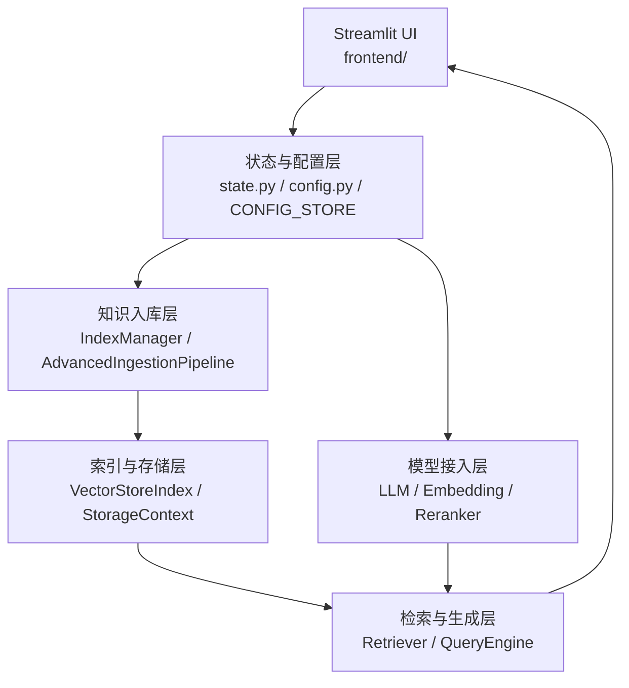
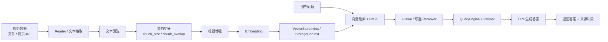

# ThinkRAG 面试全集合并版

## 1. 这份文档怎么用

这是一份把 `docs/interview` 下原有面试相关文档整合成的一份总文档。

它的目标不是做成百科，而是让你：

1. 能快速背项目介绍
2. 能顺着主链路讲清系统
3. 能回答高频追问
4. 能补上 `LlamaIndex` 这类框架认知
5. 能从简历表述自然过渡到技术细节

建议阅读顺序：

1. 先看 `第 2 节`：1 分钟版本
2. 再看 `第 3 节`：3 分钟版本
3. 再看 `第 4-8 节`：核心技术主链路
4. 再看 `第 9-12 节`：高频追问
5. 最后看 `第 13-15 节`：LlamaIndex、STAR、速记版

如果你时间非常紧，只看：

1. `第 2 节`
2. `第 3 节`
3. `第 9 节`
4. `第 15 节`

---

## 2. 1 分钟项目介绍

如果面试官说“你介绍一下这个项目”，最稳的一版可以这样说：

> 我做的这个项目叫 `ThinkRAG`，它本质上是一个本地知识库智能问答系统，目标是解决私有知识难沉淀、通用大模型无法直接利用本地资料的问题。用户可以把本地文件或者网页内容导入知识库，然后通过大模型完成更准确的问答。前端用的是 `Streamlit`，后端核心基于 `LlamaIndex` 做知识入库、索引和查询编排。  
>  
> 系统支持文件和网页两类知识源，入库时会先做文本抽取、清洗、切分、中文标题增强、Embedding 和索引构建。查询时不是只做向量检索，而是把向量检索和 `BM25` 结合成混合检索，并支持 `Query Fusion` 和可选 `Reranker` 做结果重排，最后由大模型生成答案并展示来源片段。  
>  
> 它的亮点主要有三点：第一，完整打通了本地知识问答闭环；第二，针对中文场景做了比较实际的优化，比如 `jieba` 分词和标题增强；第三，兼容本地 `Ollama` 和 OpenAI 兼容 API，同时支持开发/生产双模式部署。

---

## 3. 3 分钟项目介绍

如果面试官愿意听你展开一点，建议这样答：

> 我把 `ThinkRAG` 理解成一个单体式的本地 RAG 应用。它的目标不是只做一个简单问答 demo，而是把模型配置、知识入库、索引管理、检索和最终回答展示做成一套完整闭环。  
>  
> 从架构上看，前端是 `Streamlit` 多页面应用，用户可以在页面里配置 `LLM`、`Embedding`、`Reranker`，也可以上传文件或者输入网页 URL。项目入口在 `app.py`，启动时会先通过 `frontend/state.py` 初始化全局状态，包括当前模型、索引管理器和用户配置。  
>  
> 知识入库有两条路径，一条是文件入库，一条是网页 URL 入库，但最终都会进入统一的 `AdvancedIngestionPipeline`。这条流水线会先做文本切分，再做中文标题增强，然后调用 embedding 模型把文本块向量化，最后通过 `IndexManager` 写入索引和存储层。  
>  
> 查询时的核心点在检索层设计。项目不是只做向量检索，而是把向量检索和 `BM25` 混合起来。原因是纯向量检索更擅长语义相似，但对专有名词和关键词精确命中不一定稳定，所以作者加了一路 BM25 作为补充。而且因为是中文场景，项目在 `server/retriever.py` 里用 `jieba` 自定义了中文 tokenizer，让 BM25 在中文上真正可用。两路召回之后，再通过 `Query Fusion` 做融合排序，如果用户开启了 `Reranker`，系统会再做一次精排，然后把这些高质量上下文交给大模型生成最终答案。  
>  
> 在模型接入上，它同时支持本地 `Ollama` 和 OpenAI 兼容 API。Embedding 和 Reranker 主要使用 `BGE` 系列中文模型。存储上又区分开发模式和生产模式，开发模式可以本地文件持久化，生产模式支持 `Redis + 向量库`，这样既适合快速验证，也为后续工程化扩展预留了空间。  
>  
> 我觉得这个项目最有价值的地方有三个。第一，它把 RAG 的完整链路做出来了，而不是只有检索算法本身。第二，它针对中文做了比较具体的优化，比如中文分词和标题增强。第三，它在工程上兼顾了本地离线和云端 API 两种使用方式。  
>  
> 当然它也有明显不足，比如现在 `Streamlit` 页面直接驱动很多核心逻辑，前后端耦合比较重；状态分散在 `config.py`、`session_state` 和本地配置存储里。如果后续继续演进，我会优先考虑把配置和状态管理收敛起来，再把索引和问答能力拆成独立服务层。

---

## 4. 架构与主链路

### 4.1 项目可以拆成哪几层

你可以把 ThinkRAG 拆成 6 层：

1. `展示层`
也就是 `Streamlit` 页面，负责交互、参数输入和结果展示。

2. `状态与配置层`
主要是 `st.session_state`、`CONFIG_STORE` 和 `config.py`。

3. `模型接入层`
包括 `LLM`、`Embedding`、`Reranker`。

4. `文档处理层`
包括文件读取、网页抓取、文本切分、标题增强、Embedding。

5. `检索与生成层`
包括 `VectorStoreIndex`、`Retriever`、`QueryEngine`、`Reranker`。

6. `存储层`
开发模式用本地文件持久化，生产模式用 `Redis + 向量库`。

### 4.2 整个系统框架一句话怎么讲

如果面试官问“这个系统整体框架是什么样的”，你可以这样说：

> ThinkRAG 整体上是一个单体式、本地化的 RAG 智能问答系统。前端用 `Streamlit` 提供交互界面，后端用 `LlamaIndex` 做 RAG 主链路编排，底层接本地 `Ollama` 或 OpenAI 兼容 API 的大模型，再配合向量检索、BM25 和可选 Reranker，完成知识库入库、检索和问答闭环。

### 4.3 模块关系图

### 4.4 模块关系图怎么讲

你可以这样解释：

1. `Streamlit UI`
负责交互，包括模型配置、文件上传、网页输入、问答展示。

2. `状态与配置层`
负责保存当前系统运行所需的配置和状态，比如当前选中的模型、Top K、chunk 参数和索引管理器实例。

3. `模型接入层`
负责创建和管理当前可用的 LLM、Embedding、Reranker。

4. `知识入库层`
负责把原始知识源加工成可检索节点。

5. `索引与存储层`
负责承接知识库索引、文档存储和向量存储。

6. `检索与生成层`
负责检索相关知识、做重排，并交给大模型生成答案。

### 4.2 一次完整问答请求的链路

用户发起一次问答时，系统大致流程是：

1. 检查当前 LLM 是否已配置
2. 检查知识库索引是否存在
3. 加载索引
4. 创建 Query Engine
5. 执行混合检索
6. 可选执行 Reranker 重排
7. 调用大模型生成答案
8. 返回答案和来源片段

### 4.3 一次知识入库的链路

文件或网页入库时，大致流程是：

1. 读取原始数据
2. 抽取和清洗文本
3. 切分成 chunk
4. 标题增强
5. 对 chunk 做 embedding
6. 构建或更新索引
7. 持久化到存储层

### 4.4 数据流图

### 4.5 数据流图怎么讲

这个图本质上表达了两条主链：

1. `知识入库链`
文件或网页先变成文本，再切分、增强、Embedding，最后进入索引和存储。

2. `问答链`
用户问题先经过混合检索和可选重排，再交给 Query Engine 和 LLM 生成答案。

---

## 5. 文档切分、Embedding、索引构建

这一节是高频追问区。

### 5.1 原始数据是什么格式

不是只有 PDF。

ThinkRAG 支持的是多源知识入库：

1. 本地文件
2. 网页 URL

文件侧依赖 `LlamaIndex` 的文件读取能力，常见的：

1. `PDF`
2. `DOCX`
3. `PPTX`

都可以作为原始数据源。

网页侧则通过 URL 抓取正文内容。

### 5.2 为什么要先统一成文本

因为后面的：

1. `Embedding`
2. `BM25`
3. `Reranker`

本质上处理的都是文本片段，而不是 PDF 文件格式本身。

所以系统前面一定要先做解析和标准化，把不同来源的数据统一成文本内容，再进入后续检索链路。

### 5.3 为什么要做文档切分

原始文档通常太长，不能直接整篇做 embedding 和检索。

切分的核心目的有两个：

1. 控制单个片段长度
2. 提高检索定位精度

如果整篇文档直接入库，检索时返回的是整篇内容，噪声会很大；切成 chunk 后，系统才能更精确地定位到某一段真正相关的内容。

### 5.4 `chunk_size` 和 `chunk_overlap` 是什么

`chunk_size` 决定单个文本块大小。

`chunk_overlap` 决定相邻文本块之间保留多少重叠内容。

为什么 overlap 很重要：

1. 可以减少 chunk 边界截断带来的语义损失
2. 能保证一些跨边界信息不会完全消失

### 5.5 切得太大或太小会怎样

切得太大：

1. 每个 chunk 主题过杂
2. 检索不够精确
3. 后续上下文噪声更大

切得太小：

1. 上下文过碎
2. 单块信息不完整
3. 语义表达不足

所以切分参数本质是在“精确定位”和“语义完整”之间找平衡。

### 5.6 中文标题增强是做什么的

很多文档切成 chunk 后，正文片段本身不一定带完整主题信息，尤其中文文档很容易出现“这一段有内容，但看不出它属于哪一章哪一节”。

ThinkRAG 在 ingestion 阶段加入了 `ChineseTitleExtractor`，尽量把章节标题信息补进 chunk，保留更多主题语义。

你可以这么说：

> 标题增强的本质是防止 chunk 切碎后失去章节语义，让正文片段即使被单独召回，也能保留它原来属于哪个主题的上下文。

### 5.7 Embedding 是什么

Embedding 就是把文本转成向量表示。

它的作用是：

> 让语义相近的文本在向量空间里距离更近，这样查询时就可以根据相似度先把语义相关的 chunk 找出来。

### 5.8 ThinkRAG 用的是什么 Embedding 模型

项目主要使用 `BGE` 系列中文 embedding 模型，比如：

1. `bge-small-zh-v1.5`
2. `bge-large-zh-v1.5`

这样选的原因是：

1. 对中文语义检索更友好
2. 与 HuggingFace、LlamaIndex 集成方便
3. small/large 两种规格适合开发模式和生产模式不同取舍

### 5.9 Embedding 在项目里什么时候执行

是在文档切分之后执行。

完整链路是：

原始文档 -> chunk -> 标题增强 -> embedding -> 节点入索引

### 5.10 为什么 Embedding 模型不能随便切换

因为已有知识库里的向量，是基于旧模型生成的。

如果中途切换 embedding 模型：

1. 向量维度可能变化
2. 语义空间可能变化

这样旧索引和新 query 的向量就不在同一坐标系里，检索结果会失真。

所以换 embedding 模型通常意味着要重建索引。

### 5.11 一段可直接背的回答

> 在 ThinkRAG 里，文档不会直接整篇入库，而是先做切分。因为原始文档太长，直接做 embedding 和检索效果都会很差，所以系统会先根据 `chunk_size` 和 `chunk_overlap` 把文档切成多个 chunk。这样既能控制片段长度，也能通过 overlap 减少上下文在边界处被截断的问题。切完之后，项目还会做中文标题增强，也就是尽量把章节标题信息补进 chunk，避免正文片段脱离主题。接下来系统会对每个 chunk 做 embedding，把文本转成向量表示。ThinkRAG 默认用的是 BGE 中文 embedding 模型，这样更适合中文知识库场景。最后这些带向量的 chunk 会进入索引层，为后续检索做基础。

---

## 5A. 知识入库逻辑详细版

这一节专门回答“这个项目的入库逻辑是怎么做的”。

### 5A.1 入库逻辑一句话

你可以先这样说：

> ThinkRAG 的入库逻辑本质上是一条统一的知识加工流水线：原始数据先被读取和清洗，再做文本切分、标题增强、Embedding，最后写入索引和存储层。

### 5A.2 文件入库是怎么走的

文件入库主要发生在 `KB_File.py` 页面。

完整过程是：

1. 用户在前端上传文件，比如 `PDF / DOCX / PPTX`
2. 前端先把文件保存到本地目录
3. 调用 `IndexManager.load_files(...)`
4. 用 `SimpleDirectoryReader` 读取文件内容
5. 把文档对象送进 `AdvancedIngestionPipeline`
6. 在 pipeline 里做：
   - 文本切分
   - 中文标题增强
   - Embedding
7. 得到一批 `nodes`
8. 再通过 `IndexManager.insert_nodes(nodes)` 写入索引
9. 最后持久化到本地或外部存储

### 5A.3 网页入库是怎么走的

网页入库主要发生在 `KB_Web.py` 页面。

它和文件入库的后半段基本一致，主要差异在前面的读取阶段：

1. 用户输入 URL
2. 调用 `IndexManager.load_websites(...)`
3. 用网页 reader 抓取正文内容
4. 如果直接抓取失败，会走回退方案
5. 对网页内容做清洗，过滤掉空内容和无效正文
6. 然后进入同一套 `AdvancedIngestionPipeline`
7. 后续同样是：
   - 切分
   - 标题增强
   - Embedding
   - 插入索引
   - 持久化

### 5A.4 为什么文件和网页最后要走统一 pipeline

这样设计有三个明显好处：

1. `复用处理逻辑`
不同知识源前面读取方式不同，但后面的知识加工步骤是相通的。

2. `降低维护成本`
切分、Embedding、索引构建不需要为每种数据源各写一遍。

3. `方便后续扩展`
如果将来新增知识源，比如数据库、接口或 Markdown 仓库，只要补前面的 reader，后面 pipeline 还能直接复用。

### 5A.5 入库逻辑里谁是核心对象

如果面试官问“这套流程是谁在管”，你可以直接点两个对象：

1. `IndexManager`
负责入库调度、索引创建、节点插入、持久化和删除。

2. `AdvancedIngestionPipeline`
负责真正的知识加工流程，也就是切分、增强和向量化。

### 5A.6 一段可直接背的“入库逻辑”回答

> ThinkRAG 的入库逻辑本质上是一条统一的知识加工流水线。文件和网页分别从不同入口进入系统，前面做各自的数据读取和清洗，后面统一进入 `AdvancedIngestionPipeline`。在这条 pipeline 里，系统会先做文本切分，再做中文标题增强，然后对每个 chunk 做 embedding，最后通过 `IndexManager` 把这些节点写入索引和存储层。这样做的好处是数据入口可以多样，但知识加工和索引构建逻辑保持统一，便于维护和扩展。

---

## 6. 混合检索、Fusion 和 Reranker

### 6.1 为什么不是纯向量检索

因为纯向量检索虽然擅长语义相似，但对下面这些内容不一定稳定：

1. 专有名词
2. 缩写
3. 编号
4. 关键词精确匹配

而知识库问答恰恰经常需要这些“精确命中能力”。

### 6.2 BM25 是干什么的

BM25 是传统关键词检索方法。

它更擅长：

1. 关键词召回
2. 术语命中
3. 专有名词精确匹配

所以 ThinkRAG 把：

1. 向量检索
2. BM25 检索

组合起来做混合检索。

### 6.3 为什么 BM25 默认 tokenizer 不适合中文

因为默认 BM25 一般按空格分词，而中文没有天然空格边界。

如果直接用默认 tokenizer：

1. 中文分词会失真
2. 词频统计会失真
3. BM25 的关键词召回能力会明显变差

所以 ThinkRAG 在 `server/retriever.py` 里用 `jieba` 做了中文 tokenizer。

### 6.4 向量检索和 BM25 是怎么融合的

项目里不是简单把两路结果拼起来，而是通过 `QueryFusionRetriever` 做融合排序。

你可以把它理解成：

> 用向量检索负责语义召回，用 BM25 补足关键词召回，再通过 Fusion 统一排序。

### 6.5 为什么权重是 0.6 / 0.4

这是一个偏工程经验的初始权重：

1. 向量侧 0.6
2. BM25 侧 0.4

含义是：

1. 整体仍以语义召回为主
2. 但保留较强的关键词补充能力

这不是绝对最优，只是适合当前默认场景的起点。如果知识库更偏术语密集，BM25 权重可以更高。

### 6.6 Reranker 是做什么的

Reranker 不是扩大召回范围，而是在召回之后做一轮精排。

你可以把它理解成：

1. 向量检索 + BM25：粗排
2. Reranker：精排

它的作用是：

> 对已经召回的候选 chunk 重新打分排序，把最相关的内容优先送给大模型。

### 6.7 一段可直接背的回答

> ThinkRAG 最终选择的是混合检索，因为单一检索方式各有明显短板。向量检索擅长语义相似，但对术语和关键词精确命中不一定稳定；BM25 正好相反，它擅长关键词召回，但对语义改写和表达差异的适应能力较弱。所以项目同时保留了两条检索路径：一条是向量检索，一条是 BM25 检索，再通过 `Query Fusion` 做融合排序。如果候选结果较多，还会增加一层 `Reranker` 做精排。这样整个检索链路就形成了“召回 + 融合 + 精排”的结构，在中文知识库问答场景里会更稳。

---

## 7. Query Engine 与生成链路

### 7.1 什么是 Query Engine

你可以把它理解成：

> 检索层和生成层之间的总装配器。

它负责把：

1. `Retriever`
2. `Prompt`
3. `Reranker`
4. `Response Mode`

这些组件装起来，形成一次完整问答能力。

### 7.2 ThinkRAG 为什么要单独封装 Query Engine

因为前端页面只应该负责：

1. 收集用户输入
2. 展示结果

而不应该直接承担底层链路装配逻辑。

把 query engine 独立出来的好处：

1. 逻辑更集中
2. 更容易复用
3. 更容易测试
4. 更方便以后服务化拆分

### 7.3 response mode 是什么

它决定多段检索结果如何被组织成最终答案。

ThinkRAG 暴露这些参数，是为了让用户根据不同模型和场景做在线调优。

---

## 8. 开发 / 生产双模式与统一模型接入

### 8.1 为什么要有开发/生产双模式

因为项目同时要兼顾：

1. 快速验证
2. 工程化落地

开发模式：

1. 本地文件持久化
2. 零数据库启动
3. 单机调试方便

生产模式：

1. `Redis`
2. 外部向量库
3. 更适合长期运行和大规模数据

### 8.2 为什么要同时支持 Ollama 和 OpenAI 兼容 API

因为两者满足不同场景：

`Ollama`

1. 本地化
2. 离线可用
3. 隐私更可控

OpenAI 兼容 API

1. 商业模型效果更稳
2. 接入更方便
3. 更适合快速验证云端能力

### 8.3 为什么要统一模型接入层

统一模型接入层的目标是：

> 让上层页面和查询逻辑不用关心底层到底是本地模型还是云端 API，只关心当前有没有一个可用的 LLM 实例。

---

## 9. 高频追问与参考回答

### 9.1 原始数据都是 PDF 吗

> 不是只有 PDF。ThinkRAG 支持的是多源知识入库，文件侧常见的像 PDF、DOCX、PPTX 都可以作为原始数据源，另外还支持网页 URL。系统不会直接拿文件格式本身去问答，而是先把不同来源统一解析成文本，再进入切分、Embedding 和索引流程。

### 9.2 为什么一个 RAG 系统的核心不只是接大模型，而是先把检索做好

> 因为大模型负责的是“基于上下文生成答案”，但它能答到什么程度，前提是你先给它找对上下文。所以如果召回阶段就偏了，后面模型再强，也只能在错误材料上生成。ThinkRAG 里我更重视检索链路设计，比如混合检索、Fusion、Reranker 和中文 tokenizer，这些都在决定系统回答的事实上限。

### 9.3 为什么用 LlamaIndex，而不是自己全写

> 因为 ThinkRAG 的主问题不是单纯调用大模型，而是把文档读取、切分、向量化、索引、检索和问答引擎组织成一条稳定的 RAG 主链路。LlamaIndex 在这些围绕知识索引和检索增强的抽象上更完整，所以我可以把精力放在中文优化、混合检索和工程落地上，而不是从零造整套轮子。

### 9.4 LlamaIndex 和 LangChain 在项目里怎么分工

> 在这个项目里，LlamaIndex 是主框架，负责知识入库、索引、Retriever 和 Query Engine 这条主链路；LangChain 更多是模型接入的补充适配层，比如 OpenAI 兼容 API 那条路径就是通过 LangChain 的 `ChatOpenAI` 再适配进 LlamaIndex。

### 9.5 如果继续改这个项目，你会先改哪里

> 我会先改状态管理和服务边界。因为当前项目作为单机原型已经能跑通，但如果继续演进，`config.py`、`session_state` 和本地配置存储之间的分散会先成为维护瓶颈；同时 Streamlit 页面直接驱动核心逻辑也不利于服务化。

---

## 10. 简历表述怎么接技术细节

如果简历上写了下面这些话，面试官很可能顺着问。

### 10.1 “主导系统架构设计与核心模块开发”

面试官可能问：

1. 你具体主导了哪些模块？
2. 怎么证明不是只参与了前端页面？

推荐回答：

> 我主导的不是单个页面，而是主链路设计，包括知识入库流水线、检索策略、Query Engine 装配、双模式存储和统一模型接入层这些核心模块。也就是说，我负责的是“数据怎么进来、怎么变成索引、怎么检索、怎么生成答案”的主流程设计，而不仅仅是交互层。

### 10.2 “支持多源知识入库”

面试官可能问：

1. 多源具体指什么？
2. 为什么要统一到同一套 pipeline？

推荐回答：

> 多源主要指本地文件和网页 URL 两类来源。前面读取和清洗方式不同，但后面统一进入同一套 ingestion pipeline，可以最大限度复用切分、标题增强、Embedding 和索引构建逻辑。

### 10.3 “完成 UI 层、知识入库层、检索生成层、存储层解耦”

面试官可能问：

1. 你说的解耦具体体现在哪？
2. 当前还存在哪些没彻底解开的地方？

推荐回答：

> 这个解耦更多体现在职责划分上，比如页面层负责交互，`IndexManager` 负责索引生命周期，`AdvancedIngestionPipeline` 负责入库主线，`QueryEngine` 负责问答链路装配，存储层通过 `StorageContext` 和不同 store 做抽象。当然它还没有完全做到前后端分离，所以我会把它定义成“单体原型里的相对解耦”，不是彻底服务化。

---

## 11. LlamaIndex 面试复习版

### 11.1 一句话理解

> `LlamaIndex` 是 ThinkRAG 的 RAG 主链路编排框架，不负责 UI，但负责文档处理、索引、检索和问答引擎装配。

### 11.2 在 ThinkRAG 里的职责

1. `Reader`：读文件和网页
2. `Splitter`：切 chunk
3. `IngestionPipeline`：处理文档
4. `VectorStoreIndex`：建索引
5. `Retriever`：查知识
6. `QueryEngine`：生成答案
7. `StorageContext / Settings`：管配置和存储

### 11.3 ThinkRAG 里最值得记住的 LlamaIndex 组件

1. `Settings`
2. `SimpleDirectoryReader`
3. `IngestionPipeline`
4. `VectorStoreIndex`
5. `StorageContext`
6. `VectorIndexRetriever`
7. `BM25Retriever`
8. `QueryFusionRetriever`
9. `RetrieverQueryEngine`
10. `SentenceTransformerRerank`

### 11.4 为什么选它

1. 更贴知识库和 RAG 场景
2. 索引、检索、QueryEngine 抽象完整
3. 便于在主链路上做中文优化和工程化扩展

### 11.5 和 LangChain 的关系

1. `LlamaIndex` 主导 RAG 主流程
2. `LangChain` 在 ThinkRAG 里主要是模型接入补充

---

## 12. STAR 回答模板

### 12.1 模板一：检索效果优化

`S`
项目是一个中文知识库问答系统，早期如果只用纯向量检索，专有名词和关键词命中不稳定。

`T`
我的任务是提升检索相关性，减少“语义上像但答案不准”的问题。

`A`
我在检索层引入了 BM25，与向量检索做混合召回；针对中文场景又加入 `jieba` tokenizer，并在候选结果较多时增加可选 `Reranker` 做精排。

`R`
最终系统形成了“向量召回 + BM25 补充 + Fusion + 可选 Reranker”的链路，整体更适合中文知识库问答，也让结果可解释性更强。

### 12.2 模板二：工程化落地

`S`
项目既要支持单机快速验证，又要为后续部署扩展留空间。

`T`
我的任务是设计既能快速启动又能工程化落地的运行方案。

`A`
我设计了开发/生产双模式。开发模式下采用本地文件持久化，实现零数据库启动；生产模式下支持 `Redis + 向量库` 切换，并通过统一存储抽象降低切换成本。

`R`
这样系统既适合快速迭代演示，也具备后续往更大规模部署演进的基础。

---

## 13. 面试里容易加分的说法

### 13.1 讲“为什么”

不要只说：

`我们用了 BM25`

更好的是：

> 因为纯向量检索对专有名词和关键词精确命中不稳定，所以又补了一路 BM25。

### 13.2 讲“边界”

不要只说：

`这个项目很完整，没什么问题`

更好的是：

> 它很适合快速验证和展示完整链路，但前后端耦合偏重，更适合单机原型。

### 13.3 讲“检索重于生成”

你可以主动说：

> 在这个项目里，我觉得检索层比生成层更关键，因为最终回答质量很大程度取决于前面召回了什么内容。

---

## 14. 面试里尽量别这么说

### 14.1 “我主要做了一个 RAG”

太泛，听不出你对项目的真实理解。

### 14.2 “就是把文档做 embedding 然后问答”

太浅，等于主动抹掉了切分、中文优化、混合检索和工程结构这些亮点。

### 14.3 “最大问题是界面不够好看”

这不是重点，容易显得判断浅。

更好的说法是：

> 当前更大的问题不在界面，而在于工程边界还比较松，比如状态分散和前后端耦合比较重。

---

## 15. 面试前速记版

### 15.1 一句话定位

`ThinkRAG` 是一个本地知识库智能问答系统，用 `Streamlit + LlamaIndex` 搭建，支持文件/网页入库，支持本地 `Ollama` 和 OpenAI 兼容 API，通过向量检索 + BM25 + 可选 Reranker 做中文知识库问答。

### 15.2 三个最该记住的亮点

1. `混合检索`
向量检索 + BM25，不是纯向量。

2. `中文优化`
`jieba` 分词 + 标题增强 + BGE 中文模型。

3. `模型接入灵活`
支持本地 `Ollama` 和 OpenAI 兼容 API。

### 15.3 三个最该记住的不足

1. `前后端耦合重`
Streamlit 页面直接驱动很多核心逻辑。

2. `状态分散`
配置散在 `config.py`、`session_state` 和持久化配置里。

3. `更适合原型`
适合单机展示，不是天然的多人服务化架构。

### 15.4 三个最该记住的类/模块

1. `IndexManager`
索引生命周期管理。

2. `AdvancedIngestionPipeline`
统一入库流水线。

3. `SimpleFusionRetriever`
混合检索核心。

### 15.5 一段最终背诵版

> 我做的这个项目叫 `ThinkRAG`，它是一个本地知识库智能问答系统，目标是解决私有知识难沉淀、通用大模型无法直接利用本地资料的问题。前端用的是 `Streamlit`，后端核心是 `LlamaIndex`。用户可以把本地文件或者网页 URL 导入知识库，系统会先做文本抽取、清洗、切分、中文标题增强、Embedding 和索引构建。查询时，项目不是只做向量检索，而是把向量检索和 `BM25` 结合成混合检索，并支持 `Query Fusion` 和可选 `Reranker` 做结果重排，最后交给大模型生成答案。它的亮点主要是链路完整、中文优化明确、模型接入灵活；不足是前后端耦合比较重、状态管理比较分散，更适合作为单机原型，后续可以继续往服务化和工程化方向演进。

---

## 16. 基础 RAG 知识提问

这一节适合你做自测，也适合面试前先把基础概念过一遍。

### 16.1 入门概念

1. 什么是 RAG？它和直接调用大模型回答问题有什么本质区别？
2. 一个标准的 RAG 系统通常包含哪些核心环节？
3. 为什么 RAG 里“检索”通常比“生成”更关键？
4. RAG 主要解决通用大模型的哪些局限？
5. 什么场景更适合用 RAG，而不是纯大模型对话？

### 16.2 文档处理与切分

1. 什么是 chunk？为什么文档不能直接整篇送去做检索和问答？
2. `chunk_size` 和 `chunk_overlap` 分别影响什么？
3. chunk 切得太大可能带来什么问题？太小又会怎样？
4. 为什么有些系统会做标题增强、段落增强或者结构增强？
5. 如果原始文档里有大量表格、代码块、列表，切分策略应该怎么调整？

### 16.3 Embedding 与索引

1. Embedding 是什么？它在 RAG 系统中的作用是什么？
2. 向量检索的核心原理是什么？为什么它能找到语义相近的内容？
3. 向量索引和普通数据库索引有什么不同？
4. 为什么更换 Embedding 模型后，往往需要重建索引？
5. Embedding 模型选择时通常会考虑哪些因素？

### 16.4 检索策略

1. BM25 是什么？它和向量检索的差别是什么？
2. 为什么很多 RAG 系统会采用“混合检索”而不是纯向量检索？
3. 混合检索里的“Fusion”通常解决什么问题？
4. Reranker 是什么？它和向量检索、BM25 的关系是什么？
5. 为什么中文场景下 BM25 往往需要自定义 tokenizer？

### 16.5 生成与评估

1. Prompt 在 RAG 里起什么作用？它只负责“润色回答”吗？
2. 什么是 hallucination（幻觉）？RAG 为什么能在一定程度上缓解它？
3. 如何评价一个 RAG 系统效果好不好？你会关注哪些指标？
4. 如果回答不准，你怎么判断问题出在检索还是生成？
5. Response Mode、Temperature、Top K 这类参数分别会影响什么？

---

## 17. 结合 ThinkRAG 项目的 RAG 提问

这一节不是泛问，而是专门围绕 ThinkRAG 这个项目来问。

### 17.1 项目整体链路

1. ThinkRAG 这个项目里，RAG 的完整链路是怎样的？
2. ThinkRAG 为什么支持“文件 + 网页 URL”两类知识源？
3. ThinkRAG 的原始数据都是什么格式？为什么最后都要统一成文本处理？
4. ThinkRAG 的开发模式和生产模式在 RAG 主链路上有什么差异？
5. ThinkRAG 里 LlamaIndex 在整套 RAG 流程里承担了什么角色？

### 17.2 文档切分与入库

1. ThinkRAG 的文档切分是在什么阶段做的？由哪个模块负责？
2. ThinkRAG 为什么在切分之后还要做“中文标题增强”？
3. ThinkRAG 里 `chunk_size` 和 `chunk_overlap` 为什么要开放成可调参数？
4. ThinkRAG 的文件入库和网页入库，在哪一步开始走统一流程？
5. ThinkRAG 的“增量更新”在入库层面是怎么理解的？

### 17.3 Embedding 与索引

1. ThinkRAG 的 Embedding 模型为什么优先选择 BGE 系列？
2. ThinkRAG 为什么既支持本地模型加载，又支持从 HuggingFace 下载模型？
3. ThinkRAG 的 Embedding 是在哪个阶段执行的？
4. ThinkRAG 为什么说 Embedding 模型一旦切换，索引通常需要重建？
5. `IndexManager` 在知识库构建里具体承担什么职责？

### 17.4 检索策略

1. ThinkRAG 为什么不用纯向量检索，而要加 BM25？
2. ThinkRAG 为了让 BM25 适配中文，具体做了什么？
3. ThinkRAG 的混合检索具体由哪些组件组成？
4. ThinkRAG 为什么要给向量检索和 BM25 设置不同权重？
5. ThinkRAG 中的 `SimpleFusionRetriever` 起了什么作用？

### 17.5 Reranker 与 Query Engine

1. ThinkRAG 中的 Reranker 是在哪个阶段介入的？它主要优化什么？
2. ThinkRAG 的 Query Engine 是怎么组装起来的？
3. ThinkRAG 为什么把 Query Engine 单独封装，而不是直接写在前端页面里？
4. ThinkRAG 的 `response_mode` 在问答过程中起什么作用？
5. 如果检索结果已经不错了，为什么还需要可选 Reranker？

### 17.6 存储与模型接入

1. ThinkRAG 为什么需要 `StorageContext` 这种抽象？
2. ThinkRAG 的开发模式和生产模式在 RAG 存储层面有什么区别？
3. ThinkRAG 为什么要同时支持本地 `Ollama` 和 OpenAI 兼容 API？
4. ThinkRAG 为什么要统一模型接入层，而不是让上层直接区分不同模型来源？
5. ThinkRAG 为什么说它更适合单机原型，而不是天然多人服务化？

---

## 18. 更像面试的深挖提问

这一节适合你做“连续追问”练习。

1. 如果用户上传的是超长 PDF，ThinkRAG 的切分策略可能遇到什么问题？
2. 如果用户的问题里包含大量专有名词，ThinkRAG 为什么比纯向量检索更有优势？
3. 如果知识库规模很小，为什么还要对 `top_k` 做安全限制？
4. 如果 Embedding 模型换了，但索引没重建，系统会出现什么问题？
5. 如果用户上传了很多结构化表格，当前 ThinkRAG 的 RAG 流程可能有什么局限？
6. 如果检索结果相关性不够，你会优先怀疑 chunk、embedding、BM25 还是 reranker？
7. 如果大模型回答不准，你怎么判断问题出在“检索”还是“生成”？
8. 如果把 ThinkRAG 从单机原型改成多人服务化系统，RAG 哪一层最需要先重构？
9. 为什么说 ThinkRAG 里的 LlamaIndex 是主链路框架，而 LangChain 只是补充？
10. 如果不用 LlamaIndex，你要自己手写哪些 RAG 基础能力？

---

## 19. 用这些问题怎么复习

你可以按下面 3 轮方式复习：

### 19.1 第一轮：过概念

只看 `第 16 节`，确保基础 RAG 概念都能解释出来。

### 19.2 第二轮：过项目映射

重点看 `第 17 节`，把每个基础概念和 ThinkRAG 里的真实实现对上。

### 19.3 第三轮：过压力追问

重点练 `第 18 节`，要求自己不只会回答“是什么”，还要能回答“为什么这么设计”和“如果继续优化怎么改”。

---

## 20. 真实面试风格追问与参考回答

这一节不是标准题库风格，而是更接近面试官现场连续追问的问法。

---

### 20.1 入库逻辑能不能做成 API？现在到底是什么形态？

**面试官可能这样问**

> 你刚才说的入库逻辑，能做成 API 吗？还是说你现在只是做了一个前端页面，点按钮才能用？

**推荐回答**

> 目前 ThinkRAG 的形态本质上还是一个 `Streamlit` 单体应用，也就是说用户主要通过前端页面去完成文件上传、网页入库、模型配置和问答交互，所以从使用方式上看，它现在更像一个有页面的本地工具，而不是一个已经独立提供 HTTP API 的后端服务。  
>  
> 但从代码结构上看，入库逻辑并不是直接写死在页面里的。页面层主要负责收集用户输入和触发动作，真正的知识入库主逻辑是在 `IndexManager` 和 `AdvancedIngestionPipeline` 里。所以如果后续要改成 API 形态，其实是可以抽出来的，比如把“文件保存、读取、切分、Embedding、索引构建”封成接口服务，再由 `FastAPI` 这类框架对外暴露。  
>  
> 所以更准确地说：**现在项目主形态是页面驱动，但核心入库逻辑具备被服务化抽成 API 的条件。**

**进一步追问时可以补**

1. 当前不是标准前后端分离架构
2. 但业务主链路已经有一定分层
3. 后续最自然的演进方向就是把 `IndexManager` / `QueryEngine` 这一类能力抽成服务

---

### 20.2 这个检索效果当时测试过吗？

**面试官可能这样问**

> 这个检索从文档里召回片段的效果，你们有专门测试过吗？

**推荐回答**

> 有意识去看过效果，但更准确地说，ThinkRAG 当前阶段更偏“工程原型 + 可运行系统”，所以它不是一个已经做得很完整的自动化评测平台。  
>  
> 我们对效果的验证主要分成两层。第一层是功能层验证，也就是看系统能不能稳定完成“文档入库 -> 召回相关 chunk -> 生成带引用的回答”这条链路。第二层是案例层验证，也就是围绕一些真实问题去看召回片段是否相关、是否漏掉关键内容、最终回答是否贴近原文。  
>  
> 如果从更工程化的角度继续推进，我会补一套更标准的评估方法，比如离线构造问答集，评估 `Recall@K`、命中率、引用片段准确率，以及回答是否基于知识库而不是模型自由发挥。

**更稳妥的说法**

不要说“我们已经有很完整的 benchmark 平台”，除非你真的做了。  
更好的说法是：

> 当前更多是基于典型 query 和 bad case 做验证，系统化评测框架是后续很值得补的一块。

---

### 20.3 有没有遇到 bad case，比如误召回和漏召回？

**面试官可能这样问**

> 检索本身是无监督的相似度匹配，肯定会有 bad case。你们有没有遇到本来不该召回却召回了，或者该召回却没召回的情况？有没有做分析和优化？

**推荐回答**

> 有，这类情况其实是 RAG 项目里非常典型的问题。ThinkRAG 里我比较关注两类 bad case。  
>  
> 第一类是**误召回**，也就是语义上看起来有点像，但其实不是用户真正要的内容。比如问题里有一个专有名词，向量检索可能因为整体语义接近，把一个主题相似但术语不对的 chunk 召回出来。  
>  
> 第二类是**漏召回**，也就是用户问题里某个关键词或者短语非常关键，但纯向量检索没有把真正对应的片段稳定找出来。  
>  
> 对这两类问题，我的分析思路通常是先判断问题出在什么层：是 `chunk` 切分不合理、embedding 表达不够好、关键词召回不足，还是召回之后排序不理想。然后再做针对性优化。  
>  
> 在 ThinkRAG 里，对应的优化主要有几类：  
> 1. 加入 `BM25`，补足关键词和术语命中能力  
> 2. 对中文 BM25 使用 `jieba` tokenizer，避免默认分词失效  
> 3. 做中文标题增强，减少 chunk 切碎后的主题信息丢失  
> 4. 在召回后增加 `Reranker`，提升最终送入 LLM 的上下文质量  
> 5. 通过 `chunk_size`、`chunk_overlap` 调整召回粒度  
>  
> 所以我的理解是，bad case 不是例外，而是 RAG 系统优化的主要来源。这个项目里很多设计，其实就是围绕 bad case 一步步加出来的。

**一句更像自己做过项目的话**

> 我会把 bad case 当成检索层调优的主要输入，而不是只盯着最终回答好不好。

---

### 20.4 你们有定义过质量指标吗？

**面试官可能这样问**

> 你有给这个系统定义一些质量指标吗？比如准确率、召回率这些，在你这个系统里怎么定义？

**推荐回答**

> 如果严格从 RAG 系统角度看，我会把质量指标拆成两层：检索层指标和最终回答层指标。  
>  
> 检索层我会更关注：  
> 1. `Recall@K`：真正相关片段有没有被召回出来  
> 2. `Hit Rate`：问题对应的关键片段是否至少命中一次  
> 3. `Top-K 命中位置`：相关片段是在前几名出现  
>  
> 回答层我会更关注：  
> 1. 回答是否基于知识库内容  
> 2. 回答是否能给出正确来源片段  
> 3. 回答是否出现明显幻觉  
> 4. 最终用户主观可用性  
>  
> 就 ThinkRAG 当前这个阶段来说，系统更偏可运行原型，所以这些指标还没有全部做成自动化平台，但如果往更工程化方向推进，我会优先补检索层的离线评估和回答层的引用准确率评估。

**如果面试官继续问“那你现在怎么验证质量”**

你可以说：

> 当前更偏基于典型问题集和 bad case 分析来做验证，也就是先看召回片段对不对，再看最终回答是不是建立在正确片段之上。

---

### 20.5 调大模型是第三方 API，还是本地部署？成本评估过吗？

**面试官可能这样问**

> 项目里大模型是调第三方 API，还是自己部署模型做在线推理？你有评估过成本吗？

**推荐回答**

> ThinkRAG 这块是双路径支持的。  
>  
> 第一条路径是本地 `Ollama`，这种更适合离线和隐私场景，优点是数据不出本机，而且没有按 token 计费的问题，成本主要是本地算力和机器资源。  
>  
> 第二条路径是 OpenAI 兼容 API，比如 `DeepSeek`、`Moonshot`、`Zhipu` 这些服务商，这种更适合快速接入商用模型能力，优点是效果通常更稳定，缺点是会有按调用量或者 token 的成本。  
>  
> 就成本这件事，当前项目里没有做很完整的自动计费和成本看板，所以我不会说我们已经有特别精确的长期成本统计。但如果从工程角度做评估，我会按“单次问答的平均输入输出 token”“每天问答次数”“模型单价”去估算 API 成本；对于本地模型，则更多评估推理延迟、CPU/GPU 占用和机器资源成本。  
>  
> 所以可以说，这个项目在能力上支持本地和 API 双路径，但成本治理这一块还可以继续补强。

**注意**

不要编一个具体数字，除非你真的做过统计。

---

### 20.6 这个系统支持多轮对话吗？历史对话怎么用？

**面试官可能这样问**

> 这个项目支持多轮对话吗？历史对话在里面有没有被利用？一般对话系统里多轮上下文怎么用，你了解吗？

**推荐回答**

> ThinkRAG 当前是支持多轮聊天交互体验的，也就是前端会保留历史对话，用户可以连续问多个问题。从实现上看，项目里有 `chat_store` 和 `ChatMemoryBuffer` 这类组件来保存聊天记录。  
>  
> 但如果更严格地区分，当前项目的“多轮支持”主要体现在**交互层和会话记忆层**，而不是已经把多轮上下文深度融入到检索 query 改写里。也就是说，现在的系统已经能保留历史问答记录，但检索主链路还是更偏基于当前问题去召回知识。  
>  
> 如果后续要进一步强化多轮能力，一般有几种做法：  
> 1. 把最近几轮历史对话拼进当前 query 的上下文里  
> 2. 先做 query rewrite，把省略指代补全后再检索  
> 3. 结合对话摘要，避免历史上下文无限增长  
>  
> 所以我的理解是：ThinkRAG 当前已经有多轮对话的基础能力，但如果想把多轮检索增强做得更成熟，还可以继续往 query rewrite 和对话摘要方向演进。

**这类问题最好诚实**

不要把“有聊天记录”说成“已经是很成熟的多轮检索系统”。

---

### 20.7 你了解 Agent 吗？能举一个你关注的 Agent 系统说说原理吗？

**面试官可能这样问**

> 你平时有关注一些 Agent 框架或者产品吗？比如开源框架、代码助手、工具调用系统。你能简单说一下它的原理吗？

**推荐回答**

> 有关注过。虽然 ThinkRAG 本身还是一个比较典型的 RAG 问答系统，不是完整 Agent 系统，但我对 Agent 的基本机制是有了解的。  
>  
> 如果举一个比较通用的 Agent 原理，可以把它理解成一个“模型 + 工具 + 循环决策”的系统。和普通 RAG 不同，普通 RAG 更像是“先检索，再回答”；而 Agent 会在中间加入“思考 - 选择工具 - 执行工具 - 观察结果 - 再决策”的过程。  
>  
> 比如一个典型 Agent 可能会先判断当前问题需不需要调用搜索、数据库、代码执行器或者文件系统工具，然后根据工具返回结果继续规划下一步，直到得到最终答案。  
>  
> 如果说机制层面，我觉得 Agent 的关键不只是调用工具，而是：  
> 1. 怎么决定何时调用工具  
> 2. 怎么把工具结果写回上下文  
> 3. 怎么控制循环次数和错误传播  
>  
> 所以从本质上讲，Agent 比 RAG 多了一层“基于目标的动态决策”。

**如果面试官继续追问**

你可以补：

> RAG 更像是知识增强，Agent 更像是任务执行增强。

---

### 20.8 LangChain 你了解多少？看过核心代码吗？

**面试官可能这样问**

> 你这里用了 LangChain，那你对 LangChain 了解多少？看过它核心代码吗？

**推荐回答**

> 在 ThinkRAG 这个项目里，我对 LangChain 的使用更多是“带着明确目的去用”，而不是把它当主框架。项目主链路是 LlamaIndex，LangChain 主要用于部分模型接入兼容层，比如通过 `ChatOpenAI` 再适配进 LlamaIndex。  
>  
> 所以如果说代码层面，我更熟悉的是它在模型调用接口、消息格式和适配层上的用法，而不是完整把 LangChain 当作主框架去读源码。  
>  
> 但从抽象上我理解它的核心思路：  
> 1. 把模型调用统一成 runnable / chain 这类可组合单元  
> 2. 把 prompt、模型、输出解析、工具调用串成链路  
> 3. 在更复杂场景里继续扩展到 agent 和工具执行  
>  
> 所以如果面试官问我，我会很诚实地说：我对 LangChain 的理解主要集中在它作为模型接入和链式调用生态补充这一层，而不是宣称自己完整啃过它所有核心源码。

**这一题最重要的是诚实**

不要把“会用”说成“通读源码”。

---

## 21. 跨项目的基础知识追问

这类题和项目没有直接关系，但面试里经常会突然切进来。

### 21.1 什么是霍夫曼树？

**推荐回答**

> 霍夫曼树是一种带权路径长度最短的二叉树，常用于数据压缩。它的核心思想是：出现频率越高的字符，编码越短；出现频率越低的字符，编码越长。构建时通常每次取权值最小的两个节点合并，最终形成整棵树。像经典的哈夫曼编码，就是基于霍夫曼树实现的。

### 21.2 最小堆是什么？构建过程是怎样的？

**推荐回答**

> 最小堆是一种完全二叉树结构，并且满足每个父节点的值都小于等于它的子节点，所以堆顶永远是最小元素。  
>  
> 构建最小堆通常有两种思路：  
> 1. 一个一个插入元素，每次插入后向上调整  
> 2. 更高效的是从一个无序数组出发，从最后一个非叶子节点开始，依次向下做 heapify 调整，最终整体建堆  
>  
> 在时间复杂度上，逐个插入建堆通常是 `O(n log n)`，而自底向上的 heapify 建堆通常是 `O(n)`。

### 21.3 如果面试官继续追问两者关系

你可以说：

> 霍夫曼树构建过程里，经常会借助最小堆来高效维护当前权值最小的节点集合，因为每次都要取最小的两个节点做合并。

---

## 22. 多轮对话、幻觉控制与用户体验优化

这一节整理的是更偏进阶的大模型问答系统问题，尤其容易出现在你已经把 RAG 主链路讲清楚之后。

### 22.1 多轮对话越来越长，怎么优化上下文维护？

**推荐回答**

> 多轮对话一旦轮数变多，直接把全部历史都塞进上下文，会带来几个问题：token 成本越来越高、推理延迟越来越大、旧内容噪声增多，而且模型容易抓错重点。所以实际工程里，一般不会无脑保留完整历史，而是会做上下文管理。  
>  
> 常见优化方式有几类：  
> 1. `滑动窗口`：只保留最近几轮  
> 2. `对话摘要`：把更早历史压缩成摘要  
> 3. `状态化存储`：把关键状态单独抽出来保存  
> 4. `历史检索`：把历史对话也做成可检索记忆，需要时再召回  
>  
> 所以本质上是在平衡“完整性、成本和相关性”。

### 22.2 如果我需要比较完整的上下文，不能接受摘要丢信息，怎么办？

**推荐回答**

> 如果对完整性要求更高，不能只靠一个摘要去覆盖全部历史，更稳的做法通常是“分层记忆”。  
>  
> 比如：  
> 1. 最近几轮保留完整原文，保证当前对话连续性  
> 2. 更早历史做摘要或状态提取，降低上下文长度  
> 3. 同时把原始历史对话保留下来，作为可检索记忆  
> 4. 当当前问题和更早历史强相关时，再把原始相关片段检索回来补进上下文  
>  
> 这样做的核心不是把所有历史都压缩掉，而是“最近的保留原文，远的做压缩或索引化，需要时再恢复原文”。

### 22.3 为什么检索完召回了以后还需要 rerank？

**推荐回答**

> 因为召回和重排解决的不是同一个问题。  
>  
> 检索阶段，尤其是向量检索或 BM25，更像是“粗排”，目标是尽量把可能相关的内容先找出来，避免漏掉；但这些候选结果的排序不一定最优。  
>  
> Reranker 的作用是“精排”，也就是对已经召回的候选片段再做一轮更细粒度的相关性判断，把真正最值得送给大模型的内容排到前面。  
>  
> 所以在 ThinkRAG 里，可以把链路理解成：  
> `向量检索 + BM25` 负责召回，`Fusion` 负责合并，`Reranker` 负责精排。  
> 这样最终进入 LLM 的上下文质量会更高。

### 22.4 怎么尽量避免大模型幻觉？

**推荐回答**

> 幻觉问题一般不是靠一个点解决，而是多层一起控制。  
>  
> 第一层是前面的检索质量要高，因为如果召回上下文本身就不对，后面的模型再强也没用。  
> 第二层是 prompt 约束，要明确告诉模型只能基于提供的知识回答，没有依据就不要编。  
> 第三层是来源可解释性，比如把来源片段展示出来，或者要求回答尽量和引用保持一致。  
> 第四层是生成自由度控制，比如降低 `temperature`，避免模型过度发散。  
> 第五层是必要时做回答校验，比如检查回答中的关键事实是否真的能在召回片段里找到依据。  
>  
> 所以我会把幻觉控制理解成“检索、约束、引用、校验”四层一起做，而不是单靠 prompt。

### 22.5 如果知识库里根本没有相关内容，是不是就回答不出来？

**推荐回答**

> 从严格的知识库问答角度讲，如果知识库里没有相关内容，那系统就不应该装作知道，否则就很容易产生幻觉。  
>  
> 但这不代表用户体验只能很差。通常可以做几种优化：  
> 1. `友好拒答`：明确说明当前知识库没有足够依据  
> 2. `区分模式`：把“知识库回答”和“通用模型推断”分开标注  
> 3. `返回相近资料`：即使没有直接答案，也给最相关片段供用户参考  
> 4. `缺口反馈`：提示用户或管理员当前知识库缺少该主题资料  
>  
> 所以系统不是一定只能沉默，而是要避免“没有依据还硬编答案”。

### 22.6 除了引用来源，还有什么办法优化这种体验？

**推荐回答**

> 除了给来源引用，还可以从交互设计上做几层增强：  
> 1. 给用户明确提示当前回答是“知识库有依据”还是“知识库无依据”  
> 2. 返回最接近的相关片段，而不是只说“答不出来”  
> 3. 给出补充建议，比如“你可以上传某类资料后再试”  
> 4. 在产品层区分严格问答模式和开放问答模式  
>  
> 这样即使没有标准答案，系统也不会显得完全失效，而是更像一个有边界感、可解释的助手。

### 22.7 一段可以直接背的回答

> 多轮对话里，随着轮数增加，直接保留全部历史会带来 token 成本、延迟和噪声问题，所以一般会做上下文优化。常见方法包括滑动窗口、对话摘要、状态化存储和历史检索。如果既想压缩成本，又尽量保留完整信息，更稳的方案通常是分层记忆：最近几轮保留原文，更早历史做摘要或索引化存储，需要时再把相关原始片段检索回来。  
>  
> 至于为什么召回之后还要 rerank，是因为检索阶段更多是粗排，目标是尽量别漏；而 reranker 是精排，目标是把真正最相关、最值得送给模型的片段排在前面。这样能提升最终上下文质量。  
>  
> 幻觉控制上，核心不是只靠 prompt，而是多层一起做：前面提高检索质量，中间限制回答边界，后面加来源引用和必要的校验机制。如果知识库里本身没有相关内容，系统最合理的做法不是硬编答案，而是明确说明当前没有足够依据，必要时再区分“知识库回答”和“通用模型推断”，这样既能减少幻觉，也能尽量保证用户体验。
