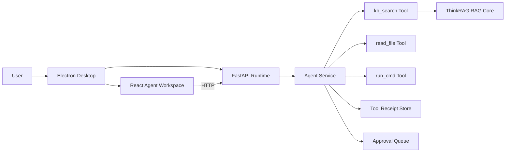

# ThinkRAG Knowledge Agent Product Plan

## 1. Product Direction

ThinkRAG should evolve from a local RAG Q&A app into a local-first intelligent knowledge agent. The target experience is close to ReflexionOS: users can see every meaningful action, approve risky operations, and replay the execution trail. The important ThinkRAG difference is that the knowledge base is a first-class agent tool, so the agent can retrieve, cite, and reason over local documents while it executes tasks.

## 2. Reference Takeaways From ReflexionOS

- Observable execution: every tool call should create a structured receipt instead of disappearing behind a loading state.
- Local-first desktop workflow: Electron hosts the UI and starts a local FastAPI runtime.
- Tool registry mindset: file reading, shell commands, patch application, and RAG search should be explicit tools.
- Human approval: medium and high risk actions must enter an approval queue.
- Auditable changes: future code edits should use patch-style diffs rather than whole-file rewrites.
- Project/session model: longer term, each local workspace should have its own sessions, memory, receipts, and knowledge sources.

## 3. Product Requirements

### PR-01 Agent Workspace

The first screen should be an agent workspace, not a passive Q&A page. It must show task input, execution timeline, current status, plan, evidence, pending approvals, and tool receipts in one place.

Acceptance:
- User can run an agent task from the workspace.
- Execution result, steps, plan, and receipts are visible without page switching.

### PR-02 RAG As Agent Tool

The agent must be able to call the knowledge base as a tool and return evidence snippets with source metadata.

Acceptance:
- `kb_search` returns answer, source snippets, source names, page labels when available, and receipt id.
- Timeline steps can reference evidence ids.

### PR-03 Observable Tool Receipts

Every tool invocation should create an ActionReceipt-like record.

Acceptance:
- Receipts include id, session id, tool name, input, output, status, and timestamp.
- Receipts are queryable by session.

### PR-04 Risk And Approval

Command execution must be risk-classified before execution.

Acceptance:
- Low risk commands can run directly.
- Medium and high risk commands enter pending approval.
- Rejected actions are audited and not executed.

### PR-05 Runtime Readiness

The FastAPI runtime must initialize the models needed for RAG and generation without relying on Streamlit session state.

Acceptance:
- File and URL import initialize embedding and splitter runtime.
- Query execution initializes embedding, splitter, and selected LLM.
- Missing LLM configuration returns a clear error.

### PR-06 Session Traceability

Agent state should be recoverable at session scope.

Acceptance for MVP:
- Recent receipts and pending approvals can be reloaded by session.
- Plan, evidence, and timeline are returned from each run.

## 4. MVP Architecture

## 5. Development Plan

### Phase 1: Knowledge Agent MVP

Goal: turn the existing rule-based agent into a visible knowledge agent.

Scope:
- Add runtime model initialization to FastAPI.
- Return `task_state`, `plan`, `steps`, `evidence`, `receipts`, and `pending_actions` from agent runs.
- Render plan and evidence in the workspace context panel.
- Keep current HTTP polling flow.
- Add tests for the new response contract.

### Phase 2: Tool Registry And Safer Execution

Goal: make tools explicit and easier to extend.

Scope:
- Extract `kb_search`, `read_file`, and `run_cmd` into tool classes/functions with schemas.
- Expand risk levels from low/medium/high to L0-L3.
- Add hard deny command patterns.
- Add command pipeline parsing.
- Persist receipts beyond in-memory storage.

### Phase 3: Coding Agent Capabilities

Goal: approach ReflexionOS-style local coding workflows.

Scope:
- Add project/workspace selection.
- Add file tree and project context indexing.
- Add patch-first editing tool.
- Add diff preview and approval before applying code edits.
- Add command output streaming.

### Phase 4: Realtime And Memory

Goal: make long tasks observable and resumable.

Scope:
- Introduce execution WebSocket or server-sent events.
- Stream receipts during execution.
- Add session memory and summary compression.
- Add project-level knowledge profiles.

## 6. Current Implementation Status

Phase 1 is now the active development target. The first code increment adds FastAPI runtime readiness, structured plan/evidence output, and workspace rendering for knowledge evidence.
