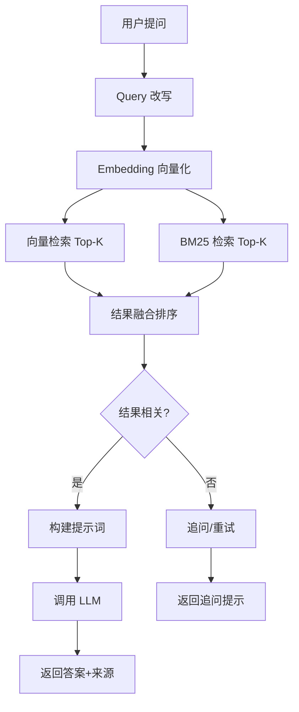

# 知识库检索 Agent 设计方案（LangGraph 版）

## 1. 目标

基于评审意见，重新设计完整的知识库问答系统：
- 完整的问答流程：提问 → 检索 → 排序 → LLM 生成答案
- 明确的技术选型
- 可观测的有状态工作流

## 2. 技术选型

### 2.1 核心依赖

```python
# requirements.txt
llama_index==0.11.19          # RAG 框架
langchain==0.3.4              # LLM 调用
langchain-openai==0.2.3       # OpenAI 兼容
langgraph>=0.2.0              # 工作流编排
llama-index-embeddings-huggingface==0.3.1  # Embedding
llama-index-retrievers-bm25==0.4.0         # BM25 检索
```

### 2.2 技术栈

| 组件 | 选型 | 现有实现 | 说明 |
|------|------|---------|------|
| Embedding | BAAI/bge-large-zh-v1.5 | `server/models/embedding.py` | 中文优化，1024维，直接复用 |
| LLM | OpenAI 兼容 API | `server/models/llm_api.py` | 支持 GPT/DeepSeek/Moonshot，直接复用 |
| 向量库（开发） | LlamaIndex SimpleVectorStore | `server/stores/docstore.py` | 开发模式，直接复用 |
| 向量库（生产） | Milvus | `server/stores/vector_store.py` | 生产环境，直接复用 |
| 文档存储 | Redis | `server/stores/docstore.py` | 生产环境，直接复用 |
| 会话存储 | Redis | `server/stores/chat_store.py` | 已支持 per-collection，直接复用 |
| 工作流 | LangGraph | **新增** | 有状态、可观测 |
| 检索 | 向量检索 + BM25 | `server/retriever.py` | 混合检索，直接复用 |
| Reranker | BAAI/bge-reranker-v2-m3 | `server/models/reranker.py` | 可选，直接复用 |

### 2.3 架构图

```
┌─────────────────────────────────────────────────────────────┐
│                      用户界面层                               │
│  ┌─────────────┐  ┌─────────────┐  ┌─────────────┐         │
│  │ 知识库管理   │  │ 问答界面    │  │ 设置界面    │         │
│  └──────┬──────┘  └──────┬──────┘  └──────┬──────┘         │
└─────────┼────────────────┼────────────────┼─────────────────┘
          ↓                ↓                ↓
┌─────────────────────────────────────────────────────────────┐
│                      API 层                                  │
│  /api/kb/create  /api/kb/search  /api/settings              │
└─────────┬────────────────┬────────────────┬─────────────────┘
          ↓                ↓                ↓
┌─────────────────────────────────────────────────────────────┐
│                   知识库问答 Agent（LangGraph）               │
│  ┌─────────────┐  ┌─────────────┐  ┌─────────────┐         │
│  │ Query 改写   │  │ 语义检索    │  │ 答案生成    │         │
│  └──────┬──────┘  └──────┬──────┘  └──────┬──────┘         │
│         │                │                │                 │
│         ↓                ↓                ↓                 │
│  ┌─────────────────────────────────────────────────────┐   │
│  │              LangGraph StateGraph                    │   │
│  │  query_rewrite → retrieve → evaluate → generate     │   │
│  └─────────────────────────────────────────────────────┘   │
└─────────┬────────────────┬────────────────┬─────────────────┘
          ↓                ↓                ↓
┌─────────────────────────────────────────────────────────────┐
│                      存储层                                  │
│  ┌─────────────┐  ┌─────────────┐  ┌─────────────┐         │
│  │ 文档存储    │  │ 向量存储    │  │ 会话存储    │         │
│  └─────────────┘  └─────────────┘  └─────────────┘         │
└─────────────────────────────────────────────────────────────┘
```

## 3. 核心流程

### 3.1 端到端问答流程



### 3.2 LangGraph State 定义

```python
from typing import TypedDict, List, Optional, Annotated
from langgraph.graph import add_messages

class AgentState(TypedDict):
    """知识库问答 Agent 状态"""
    # 用户输入
    question: str
    session_id: str
    user_id: str
    kb_ids: List[str] | str  # "auto" 或 知识库ID列表

    # 对话历史（LangGraph 自动管理）
    messages: Annotated[list, add_messages]

    # Query 改写
    rewritten_query: str
    is_clarify: bool
    context: Optional[dict]

    # 检索结果
    evidence: List[dict]
    retrieval_score: float
    top_k: int

    # 上下文窗口管理
    context_window: str  # 经过压缩/截断后送给 LLM 的文本
    context_profile: str  # "small"(4k) / "medium"(16k) / "large"(128k)

    # 回答
    answer: str
    confidence: float

    # 控制
    retry_count: int
    max_retries: int
    need_clarify: bool
    clarify_question: str
    config: dict  # {rerank, score_threshold, ...}
```

### 3.3 LangGraph 工作流

```python
# server/agent/graph.py
from langgraph.graph import StateGraph, END
from .state import AgentState

def create_kb_agent_graph():
    """创建知识库问答 Agent 工作流"""
    
    workflow = StateGraph(AgentState)
    
    # 添加节点
    workflow.add_node("query_rewrite", query_rewrite_node)
    workflow.add_node("retrieve", retrieve_node)
    workflow.add_node("evaluate", evaluate_node)
    workflow.add_node("generate_answer", generate_answer_node)
    workflow.add_node("clarify", clarify_node)
    
    # 定义边
    workflow.set_entry_point("query_rewrite")
    workflow.add_edge("query_rewrite", "retrieve")
    workflow.add_edge("retrieve", "evaluate")
    
    # 条件边：根据评估结果决定下一步
    workflow.add_conditional_edges(
        "evaluate",
        evaluate_condition,
        {
            "relevant": "generate_answer",
            "irrelevant": "query_rewrite",  # 重试
            "need_clarify": "clarify",
        }
    )
    
    workflow.add_edge("generate_answer", END)
    workflow.add_edge("clarify", END)
    
    return workflow.compile()
```

## 4. 核心模块设计

### 4.1 Query 改写模块

```python
# server/agent/query_rewriter.py
class QueryRewriter:
    """Query 改写：基于上下文优化检索效果

    设计说明：
    - V1 使用 LLM 改写（更准确），通过 langchain 调用 LLM 进行上下文补全
    - V2 可升级为专用小模型改写（如 Qwen2.5-1.5B），降低延迟和成本
    - 关键词快速检测作为前置过滤，仅 LLM 改写失败的兜底
    """

    CLARIFY_KEYWORDS = ["什么意思", "解释", "详细", "然后呢", "还有吗"]

    def __init__(self, llm):
        self.llm = llm  # langchain LLM 实例
        self.rewrite_prompt = ChatPromptTemplate.from_messages([
            ("system", "你是一个查询改写助手。根据对话历史，将用户的最新问题改写为独立完整的查询。"
                       "要求：1) 补全指代词 2) 保持原意 3) 输出仅返回改写后的查询文本"),
            ("human", "对话历史：\n{chat_history}\n\n最新问题：{question}\n\n改写后的查询：")
        ])

    def rewrite(self, question: str, context: dict = None) -> dict:
        """
        改写查询

        输入：
        - question: 原始问题
        - context: 上下文（含 chat_history, current_topic）

        输出：
        - {"rewritten_query": str, "is_clarify": bool}
        """
        is_clarify = any(kw in question for kw in self.CLARIFY_KEYWORDS)
        chat_history = (context or {}).get("chat_history", [])

        # 快速路径：无上下文 + 非澄清追问，无需改写
        if not is_clarify and not chat_history:
            return {"rewritten_query": question, "is_clarify": False}

        # LLM 改写路径
        try:
            history_text = self._format_history(chat_history)
            rewritten = self.llm.invoke(
                self.rewrite_prompt.format(
                    chat_history=history_text,
                    question=question
                )
            ).content.strip()
            return {"rewritten_query": rewritten, "is_clarify": is_clarify}
        except Exception:
            # 兜底：LLM 改写失败时使用简单拼接
            if is_clarify and context and context.get("current_topic"):
                rewritten = f"{context['current_topic']}的{question}"
            else:
                rewritten = question
            return {"rewritten_query": rewritten, "is_clarify": is_clarify}

    def _format_history(self, chat_history: list) -> str:
        """格式化对话历史为文本"""
        lines = []
        for msg in chat_history[-3:]:  # 最近 3 轮
            role = "用户" if msg.get("role") == "user" else "助手"
            lines.append(f"{role}：{msg.get('content', '')}")
        return "\n".join(lines)
```

### 4.2 语义检索模块（复用现有 retriever.py）

> **重要**：不新建检索逻辑，直接复用 `server/retriever.py` 的 `get_query_engine()`，
> 它已实现 Vector + BM25 混合检索 + ScoreFusion + 可选 Reranker。

```python
# server/agent/retriever.py
# 封装现有 server/retriever.py，作为 LangGraph 的 retrieve 节点

from server.retriever import get_query_engine

class AgentRetriever:
    """Agent 检索节点：封装现有 retriever.py 为 LangGraph 节点"""

    def retrieve(self, query: str, collection: str, top_k: int = 5, rerank: bool = False) -> list:
        """
        检索（复用现有混合检索能力）

        输入：
        - query: 查询问题（已改写）
        - collection: 知识库集合名
        - top_k: 返回结果数
        - rerank: 是否启用 reranker

        输出：
        - list[dict]: 检索结果，含 {content, score, metadata}
        """
        # 直接调用现有的 query engine（已包含 vector + BM25 混合检索）
        query_engine = get_query_engine(
            index="doc_index",
            collection=collection,
            top_k=top_k,
            rerank=rerank,
        )

        # 执行检索
        response = query_engine.query(query)

        # 提取 source nodes
        results = []
        for node in response.source_nodes:
            results.append({
                "content": node.node.get_text(),
                "score": float(getattr(node, "score", 0)),
                "metadata": node.node.metadata,
            })

        return results
```

### 4.3 答案生成模块

```python
# server/agent/answer_generator.py
class AnswerGenerator:
    """答案生成：基于检索结果调用 LLM"""
    
    def generate(self, question: str, evidence: list, context: dict = None) -> dict:
        """
        生成回答
        
        输入：
        - question: 用户问题
        - evidence: 证据列表
        - context: 上下文
        
        输出：
        - {"answer": str, "confidence": float, "sources": list}
        """
        # 1. 构建提示词
        prompt = self._build_prompt(question, evidence)
        
        # 2. 调用 LLM
        answer = self._call_llm(prompt)
        
        # 3. 提取来源
        sources = self._extract_sources(evidence)
        
        # 4. 计算置信度
        confidence = self._calculate_confidence(evidence)
        
        return {"answer": answer, "confidence": confidence, "sources": sources}
    
    def _build_prompt(self, question: str, evidence: list) -> str:
        """构建提示词"""
        evidence_text = "\n\n".join([
            f"【来源】{e.get('source', 'N/A')}（第{e.get('page', 'N/A')}页）\n"
            f"【内容】{e.get('excerpt', '')}"
            for e in evidence
        ])
        
        return f"""你是一个专业的知识库问答助手。请基于以下知识库内容回答用户问题。

知识库内容：
{evidence_text}

用户问题：{question}

要求：
1. 回答必须基于上述知识库内容，不要编造
2. 如果知识库中没有相关信息，请明确说明
3. 在回答中标注引用来源
4. 回答要简洁准确"""
    
    def _call_llm(self, prompt: str) -> str:
        """调用 LLM（复用现有 server/models/llm_api.py）"""
        from server.models.llm_api import create_openai_llm
        from llama_index.core.llms import ChatMessage

        # 使用项目统一的 LLM 创建方式（支持任意 OpenAI 兼容 API）
        llm = create_openai_llm()

        messages = [
            ChatMessage(role="system", content="你是一个专业的知识库问答助手。"),
            ChatMessage(role="user", content=prompt),
        ]

        response = llm.chat(messages)
        return response.message.content
    
    def _extract_sources(self, evidence: list) -> list:
        """提取来源"""
        return [
            {
                "kb_id": e.get("kb_id"),
                "source": e.get("source"),
                "page": e.get("page"),
                "score": e.get("score"),
            }
            for e in evidence
        ]
    
    def _calculate_confidence(self, evidence: list) -> float:
        """计算置信度"""
        if not evidence:
            return 0.0
        
        # 基于证据数量和分数计算
        avg_score = sum(e.get("score", 0) for e in evidence) / len(evidence)
        count_bonus = min(len(evidence) / 5, 1)  # 最多5个证据
        
        return min(avg_score * 0.7 + count_bonus * 0.3, 1.0)
```

### 4.4 节点实现

```python
# server/agent/graph.py

def query_rewrite_node(state: AgentState) -> dict:
    """Query 改写节点"""
    from .query_rewriter import QueryRewriter
    
    rewriter = QueryRewriter()
    result = rewriter.rewrite(state["question"], state.get("context"))
    
    return {
        "rewritten_query": result["rewritten_query"],
        "is_clarify": result["is_clarify"],
    }


def retrieve_node(state: AgentState) -> dict:
    """检索节点"""
    from .retriever import AgentRetriever

    retriever = AgentRetriever()
    results = retriever.retrieve(
        state["rewritten_query"],
        state["kb_ids"],
        top_k=state.get("top_k", 5),
        rerank=state.get("config", {}).get("rerank", False),
    )
    
    # 计算平均分数
    avg_score = sum(r.get("score", 0) for r in results) / len(results) if results else 0
    
    return {
        "evidence": results,
        "retrieval_score": avg_score,
    }


def evaluate_node(state: AgentState) -> dict:
    """评估节点"""
    score = state["retrieval_score"]
    retry_count = state.get("retry_count", 0)
    max_retries = state.get("max_retries", 2)
    
    # 评估检索结果
    if score > 0.7:
        return {"status": "relevant"}
    elif retry_count < max_retries:
        return {"status": "irrelevant", "retry_count": retry_count + 1}
    else:
        return {"status": "need_clarify"}


def evaluate_condition(state: AgentState) -> str:
    """评估条件"""
    score = state["retrieval_score"]
    retry_count = state.get("retry_count", 0)
    max_retries = state.get("max_retries", 2)
    
    if score > 0.7:
        return "relevant"
    elif retry_count < max_retries:
        return "irrelevant"
    else:
        return "need_clarify"


def generate_answer_node(state: AgentState) -> dict:
    """生成回答节点"""
    from .answer_generator import AnswerGenerator

    generator = AnswerGenerator()
    result = generator.generate(
        state["question"],
        state["evidence"],
        state.get("context")
    )

    return {
        "answer": result["answer"],
        "confidence": result["confidence"],
    }


def clarify_node(state: AgentState) -> dict:
    """追问节点"""
    return {
        "need_clarify": True,
        "clarify_question": "抱歉，我无法找到相关信息。请问您能提供更多细节吗？",
        "answer": "抱歉，我无法找到相关信息。请问您能提供更多细节吗？",
    }
```

## 5. 数据结构

### 5.1 请求结构

```python
class KbSearchRequest(BaseModel):
    question: str
    session_id: str = "default"
    kb_ids: List[str] | str = "auto"  # "auto" 或 知识库ID列表
    context_mode: str = "auto"  # auto/none/refresh
    max_results: int = 5
    max_retries: int = 2
```

### 5.2 响应结构

```python
class KbSearchResponse(BaseModel):
    answer: str
    evidence: List[dict]
    confidence: float
    rewritten_query: str
    kb_used: List[str]
    need_clarify: bool = False
    clarify_question: str = ""
    sources: List[dict]
    execution_trace: List[dict]  # 执行轨迹
```

## 6. 执行轨迹

LangGraph 自动记录每一步：

```json
{
  "trace": [
    {
      "step": "query_rewrite",
      "input": {"question": "什么意思"},
      "output": {"rewritten_query": "环境配置的什么意思", "is_clarify": true},
      "duration_ms": 5
    },
    {
      "step": "retrieve",
      "input": {"rewritten_query": "环境配置的什么意思", "kb_ids": ["tech-docs"]},
      "output": {"evidence_count": 3, "avg_score": 0.82},
      "duration_ms": 150
    },
    {
      "step": "evaluate",
      "input": {"score": 0.82},
      "output": {"status": "relevant"},
      "duration_ms": 2
    },
    {
      "step": "generate_answer",
      "input": {"evidence_count": 3},
      "output": {"confidence": 0.85},
      "duration_ms": 500
    }
  ]
}
```

## 7. 实现计划

### Phase 1：基础框架（2天）
- **依赖**：无
- **文件清单**：
  - `server/agent/__init__.py` — Agent 包初始化
  - `server/agent/state.py` — AgentState 定义（含 question, rewritten_query, kb_ids, evidence, answer, chat_history, execution_trace 等字段）
  - `server/agent/graph.py` — LangGraph 工作流定义（节点注册、边连接、编译）
- **验收**：可创建 Agent 实例，工作流编译通过

### Phase 2：核心模块（4天）
- **依赖**：Phase 1 完成
- **文件清单**：
  - `server/agent/query_rewriter.py`（1天）— QueryRewriter 类，含 LLM 改写 + 关键词兜底
  - `server/agent/retriever.py`（2天）— AgentRetriever 类，封装现有 `server/retriever.py` 的 `get_query_engine()`
  - `server/agent/answer_generator.py`（1天）— AnswerGenerator 类，提示词构建 + LLM 调用 + 来源标注
- **验收**：各模块单元测试通过，可独立调用

### Phase 3：集成测试（2天）
- **依赖**：Phase 2 完成
- **文件清单**：
  - `server/agent/__init__.py`（更新）— 导出所有模块
  - `tests/test_agent.py` — 端到端集成测试
  - `tests/test_query_rewriter.py` — QueryRewriter 单元测试
  - `tests/test_retriever.py` — AgentRetriever 单元测试
  - `tests/test_answer_generator.py` — AnswerGenerator 单元测试
- **验收**：端到端流程通过，执行轨迹可验证，性能达标

## 8. 总结

基于评审意见，本方案：
1. **明确了功能定义**：知识库管理 → 语义检索 → 答案生成
2. **完整了核心流程**：提问 → 检索 → 排序 → LLM 生成答案
3. **明确了技术选型**：bge-large-zh-v1.5 + OpenAI 兼容 + LangGraph
4. **可量化验收标准**：准确率、延迟、覆盖率

预计实现周期：8天
