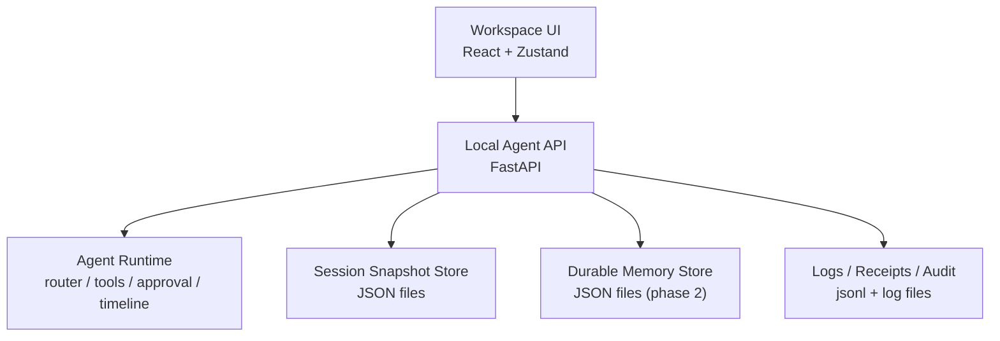
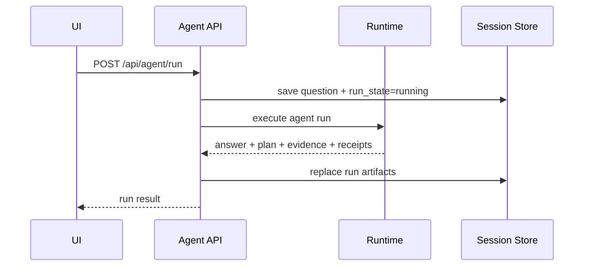
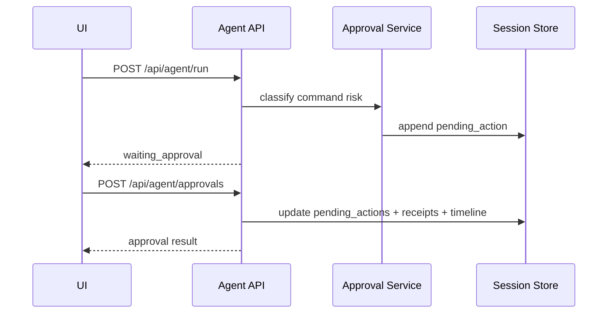
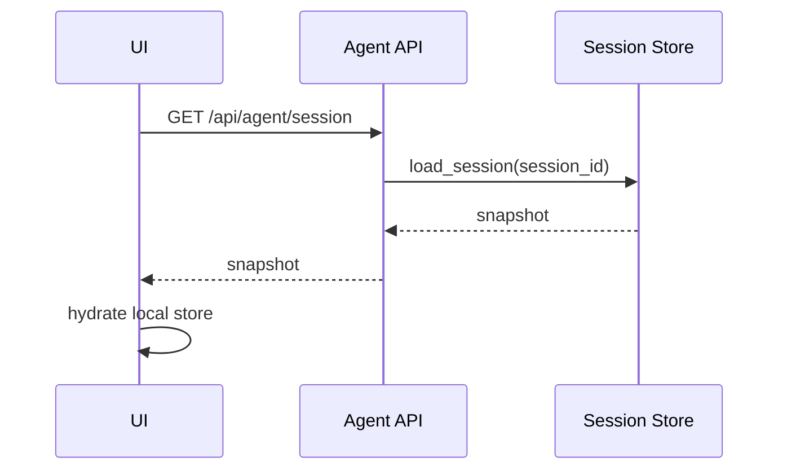

# NorthAgent 上下文保存与记忆架构设计

## 1. 文档目标

本文档定义 NorthAgent 桌面端第一阶段的上下文保存方案，目标是先把 Agent 做成一个可连续使用、可恢复现场、可审计排障的桌面产品，再为后续知识库接入和长期记忆扩展留出稳定边界。

这份方案解决的是下面几个问题：

- 应用重启后，聊天记录、时间线、审批状态、回执是否还能恢复
- 对话进行到一半时，草稿、模式、当前模型是否会丢
- 高风险命令待审批时，重启后是否还能继续处理
- 后续加入知识库、长期偏好、项目记忆时，是否需要推翻当前实现

本文档不追求一次性做复杂记忆系统，而是采用两层策略：

- 第一层：`Session Snapshot`
- 第二层：`Durable Memory`

第一层先落地，第二层先预留结构和接口。

---

## 2. 设计原则

### 2.1 用户可感知状态优先

第一阶段的重点不是“让 Agent 自动记住一切”，而是“用户关掉再打开，现场还在”。所以优先保存以下信息：

- 当前会话消息
- 当前运行结果
- 待审批动作
- 当前模型和模式
- 输入中的草稿

### 2.2 后端是唯一真源

前端 Zustand store 只做运行时状态映射，不做主存储。真正的会话状态由本地 API 统一读写，避免 Electron 重启、页面刷新或 store 重建后出现状态错乱。

### 2.3 分层清晰，不混日志和上下文

运行日志、工具原始输出、审批审计记录必须和会话快照分离。会话快照服务于恢复现场；日志服务于排障和审计。这两者用途不同，不能混在一起。

### 2.4 先做稳定恢复，再做智能压缩

第一阶段不做复杂的自动摘要、长期语义检索、对话压缩。先把“状态不丢”做好，再在第二阶段考虑：

- 长对话摘要
- 重要事实抽取
- 项目级长期记忆

### 2.5 文件存储优先

当前项目是本地桌面 Agent，第一阶段优先采用 JSON 文件落盘，而不是数据库或向量库。这样实现简单、可调试、可导入导出、用户也可以手工编辑。

---

## 3. 当前现状与问题

当前仓库中，多个关键上下文仍然停留在内存中：

- `api/services/chat_service.py`
  - `_CHAT_HISTORY`
- `api/services/tool_receipt_store.py`
  - `_RECEIPTS`
- `api/services/approval_service.py`
  - `_PENDING_ACTIONS`
  - `_SESSION_ACTIONS`
- `webapp/src/store/appStore.js`
  - Zustand store 仅在前端内存中存在

这会导致以下问题：

1. 应用重启后，聊天记录丢失
2. 应用重启后，审批待办丢失
3. 工具回执只在当前进程可见
4. 输入框草稿、当前模式、界面状态无法恢复
5. 未来如果引入知识库或更复杂工具，状态面会越来越混乱

因此，第一阶段必须引入统一的会话快照中心，而不是继续在各 service 里维护各自的内存字典。

---

## 4. 总体架构

推荐采用四层结构：



四层职责如下：

### 4.1 Runtime Context

负责单次 Agent run 的瞬时上下文。

包含：

- 当前 question
- 当前 provider / model
- 当前路由决策
- 本轮工具执行中间结果
- 计划构建过程

特点：

- 仅在一次运行过程中存在
- 可以放在内存里
- 不直接承担跨重启恢复职责

### 4.2 Session Snapshot

负责保存“用户打开应用后能看到和继续使用的上下文现场”。

包含：

- 会话消息
- 时间线
- 证据摘要
- 工具回执摘要
- 待审批动作
- 当前模式
- 当前 provider / model
- 输入框草稿

特点：

- 第一阶段核心
- 文件落盘
- 启动时恢复
- 每个关键动作都要回写

### 4.3 Durable Memory

负责跨会话长期保留的信息。

包含：

- 用户偏好
- 项目约束
- 明确确认过的规则
- 常用工作目录
- 默认模型偏好

特点：

- 第二阶段实现
- 不等于聊天历史
- 不直接等于知识库

### 4.4 Logs / Receipts

负责排障、审计、回放。

包含：

- Agent run 日志
- 审批日志
- 工具执行日志
- 详细回执

特点：

- 不参与 prompt 拼接
- 不直接做 UI 主恢复源
- 但应支持 UI 查看摘要和展开详情

---

## 5. 第一阶段范围

第一阶段只做两件大事：

1. 建立 `Session Snapshot`
2. 把现有聊天、审批、回执、页面恢复统一接入这个快照层

第一阶段不做：

- 自动提炼长期偏好
- 向量记忆检索
- 图谱记忆
- 自动对话压缩
- 知识库驱动的长期项目记忆

这意味着第一阶段的目标很明确：

- 重启可恢复
- 审批不断链
- 切模型不断链
- 草稿不丢
- 回执和时间线不丢

---

## 6. 存储目录设计

建议新增并统一为以下目录：

```text
storage/
  config_store.json
  sessions/
    desktop-default.json
    <session_id>.json
  memory/
    profile.json
    project.json
  logs/
    agent/
    approval/
    tool/
```

说明：

- `config_store.json`
  - 已用于 provider / model 配置，继续保留
- `sessions/`
  - 每个会话一个 JSON 文件
- `memory/`
  - 第二阶段使用
- `logs/`
  - 详细日志和 jsonl 文件

---

## 7. Session Snapshot 数据模型

### 7.1 顶层结构

建议固定为：

```json
{
  "version": 1,
  "session_id": "desktop-default",
  "updated_at": "2026-05-29T12:00:00Z",
  "workspace": {},
  "chat_history": [],
  "timeline": [],
  "plan": [],
  "evidence": [],
  "receipts": [],
  "pending_actions": [],
  "task_state": null,
  "approval_message": "",
  "ui_state": {}
}
```

### 7.2 workspace 字段

`workspace` 用于保存当前工作现场，建议结构如下：

```json
{
  "current_mode": "agent",
  "provider": {
    "name": "aliyun-bailian",
    "base_url": "https://dashscope.aliyuncs.com/compatible-mode/v1",
    "model": "qwen-plus"
  },
  "knowledge_scope": {
    "kb_id": "default",
    "kb_name": "NorthAgent Workspace"
  },
  "task_goal": "",
  "draft_question": "",
  "run_state": "idle",
  "last_answer": ""
}
```

字段说明：

- `current_mode`
  - 当前运行模式，第一阶段保持现有枚举：`agent`、`kb_search`、`read_file`、`run_cmd`
- `provider`
  - 当前选中的模型供应商和模型
- `knowledge_scope`
  - 先保留结构，后续知识库接入可直接复用
- `task_goal`
  - 当前任务目标摘要
- `draft_question`
  - 输入框中的未发送内容
- `run_state`
  - `idle`、`running`、`completed`、`waiting_approval`、`failed`
- `last_answer`
  - 最后一条主回答，便于快速恢复

### 7.3 chat_history 字段

```json
[
  {
    "id": "msg_001",
    "role": "user",
    "content": "帮我查看当前目录",
    "created_at": "2026-05-29T12:01:00Z"
  },
  {
    "id": "msg_002",
    "role": "assistant",
    "content": "我先查看当前目录内容。",
    "created_at": "2026-05-29T12:01:03Z"
  }
]
```

要求：

- 每条消息带唯一 id
- 每条消息带时间
- 第一阶段只保存文本，不保存复杂富文本块

### 7.4 timeline 字段

保留现有前端可渲染结构：

```json
[
  {
    "type": "task",
    "content": "查看当前目录",
    "meta": {
      "mode": "run_cmd",
      "stage": "submitted"
    }
  }
]
```

要求：

- timeline 是 UI 的直接渲染输入
- 后端保存最终结构，前端不再二次猜测

### 7.5 plan / evidence / receipts / pending_actions

这几类结构建议与当前 `api/schemas.py` 对齐，避免引入第二套模型。

原则：

- `plan`
  - 只保存面向用户可见的计划项
- `evidence`
  - 只保存证据摘要，不保存全文
- `receipts`
  - 保存摘要字段和必要引用，不把超大输出全量塞入 session
- `pending_actions`
  - 必须完整保存审批所需字段，确保重启后还能继续处理

### 7.6 ui_state 字段

只保存少量桌面体验必要字段：

```json
{
  "active_detail": "receipts",
  "show_details": true
}
```

不建议保存：

- 所有展开折叠状态
- 像素级布局信息
- 临时 hover 态

---

## 8. Durable Memory 设计

第二阶段采用轻量结构化记忆，不直接上向量库。

### 8.1 profile.json

用于保存用户长期偏好：

```json
{
  "version": 1,
  "default_provider": "aliyun-bailian",
  "default_model": "qwen-plus",
  "preferences": {
    "language": "zh-CN",
    "approval_policy": "warn_and_confirm",
    "ui_density": "comfortable"
  }
}
```

### 8.2 project.json

用于保存项目级长期约束：

```json
{
  "version": 1,
  "project_name": "NorthAgent",
  "constraints": [
    "桌面端优先",
    "当前阶段先做 Agent，不先做知识库主入口",
    "允许用户自定义 base_url、api_key、model"
  ],
  "working_directories": [],
  "important_decisions": []
}
```

### 8.3 为什么第二阶段不用聊天历史替代长期记忆

因为聊天历史是流水账，长期记忆是被确认过的稳定事实。这两者不应该混在一起。

例如：

- “昨天临时试了一下某个模型”
  - 属于会话历史
- “默认供应商改成阿里百炼”
  - 属于长期偏好

---

## 9. 后端模块拆分方案

建议新增以下文件：

- `api/services/session_store.py`
- `api/services/memory_store.py`

并逐步改造现有文件：

- `api/services/chat_service.py`
- `api/services/tool_receipt_store.py`
- `api/services/approval_service.py`
- `api/services/agent_runtime.py`
- `api/services/agent_service.py`

### 9.1 session_store.py 职责

这是第一阶段最关键的新模块，职责如下：

- 生成默认 session 结构
- 按 session_id 加载会话快照
- 原子写入快照
- 增量更新快照
- 检测损坏文件并自动备份
- 对快照做版本迁移

建议暴露的方法：

```python
load_session(session_id: str) -> dict
save_session(session_id: str, snapshot: dict) -> dict
update_session(session_id: str, patch: dict) -> dict
reset_session(session_id: str) -> dict
append_chat_message(session_id: str, role: str, content: str) -> dict
replace_run_artifacts(session_id: str, payload: dict) -> dict
upsert_pending_action(session_id: str, action: dict) -> dict
replace_pending_actions(session_id: str, actions: list[dict]) -> dict
append_receipt(session_id: str, receipt: dict) -> dict
```

### 9.2 memory_store.py 职责

第二阶段使用，职责如下：

- 加载和保存用户偏好
- 加载和保存项目级约束
- 预留记忆条目管理能力

---

## 10. 原子写入与容错策略

会话文件是核心状态，写入时不能直接覆盖。

建议流程：

1. 先序列化为 JSON
2. 写入 `desktop-default.json.tmp`
3. 校验可读
4. 再 replace 正式文件

容错要求：

- 如果 JSON 文件损坏
  - 重命名为 `desktop-default.broken.<timestamp>.json`
  - 自动生成默认快照
- 如果缺字段
  - 按 version 做补字段迁移
- 如果写盘失败
  - 当前内存态仍允许继续运行
  - 同时写错误日志

---

## 11. API Contract 设计

### 11.1 Session API

第一阶段新增以下接口：

#### `GET /api/agent/session`

入参：

- `session_id`

返回：

```json
{
  "session_id": "desktop-default",
  "snapshot": {}
}
```

用途：

- 应用启动时恢复
- 页面刷新时恢复

#### `PUT /api/agent/session`

入参：

```json
{
  "session_id": "desktop-default",
  "workspace": {
    "current_mode": "agent",
    "draft_question": "你好"
  },
  "ui_state": {
    "active_detail": "receipts"
  }
}
```

用途：

- 保存草稿
- 保存当前模式
- 保存当前 provider / model 快照
- 保存少量 UI 状态

要求：

- 支持局部 patch
- 不能要求每次提交完整 snapshot

#### `POST /api/agent/session/reset`

入参：

- `session_id`

用途：

- 清空当前会话
- 保留模型配置
- 保留长期记忆

### 11.2 现有 Agent API 的回写要求

现有接口在成功执行后必须把结果同步到 Session Snapshot：

- `POST /api/agent/run`
- `GET /api/agent/receipts`
- `GET /api/agent/pending`
- `POST /api/agent/approvals`

具体要求：

- `run` 完成后回写：
  - `timeline`
  - `plan`
  - `evidence`
  - `receipts`
  - `pending_actions`
  - `task_state`
  - `workspace.last_answer`
  - `workspace.run_state`
- `approvals` 完成后回写：
  - `pending_actions`
  - `receipts`
  - `timeline`
  - `task_state`
  - `approval_message`

---

## 12. 前端恢复与保存机制

### 12.1 启动恢复流程

前端启动时：

1. 读取默认 `sessionId`
2. 调用 `GET /api/agent/session`
3. 使用 `hydrateWorkspace(snapshot)` 一次性恢复
4. 再触发 receipts / pending 的轻量补拉取作为兜底

建议在 `webapp/src/store/appStore.js` 中新增：

- `hydrateSessionSnapshot(snapshot)`
- `setWorkspacePatch(patch)`
- `setUiStatePatch(patch)`

### 12.2 输入草稿自动保存

草稿每次输入都立即写盘会过于频繁，建议：

- 对 `draftQuestion` 做 300ms 到 500ms debounce
- 只在值变化时 patch 保存

### 12.3 模式和模型切换保存

以下动作应立即写入 session：

- 切换 mode
- 切换 provider
- 切换 model

原因：

- 重启后应恢复到用户上一次的工作面
- 避免页面显示的模型和后端实际模型脱节

### 12.4 审批状态恢复

待审批动作必须完全依赖后端 session 恢复，而不是前端 store 记忆。

重启后的正确行为应是：

1. 恢复快照
2. UI 直接看到待审批项
3. 用户仍可批准或拒绝
4. 审批后正常更新 timeline 和 receipts

---

## 13. 状态流转

### 13.1 普通 Agent 运行



### 13.2 高风险命令审批



### 13.3 应用重启恢复



---

## 14. 与现有模块的改造映射

### 14.1 chat_service.py

现状：

- 用 `_CHAT_HISTORY` 维护消息列表

目标：

- 改为读写 `session_store`

改造方式：

- `query()` 里追加 user / assistant 消息到 session
- `get_history()` 改为从 session 读取
- `clear_history()` 改为 reset 对应消息区块

### 14.2 tool_receipt_store.py

现状：

- 用 `_RECEIPTS` 维护回执

目标：

- 改为回写 session snapshot
- 同时保留详细日志文件

改造方式：

- `append_receipt()` 写 session 摘要
- 如输出过大，只写 preview + log reference

### 14.3 approval_service.py

现状：

- `_PENDING_ACTIONS` 和 `_SESSION_ACTIONS` 在内存里

目标：

- 改为从 session 快照维护 pending list

改造方式：

- `create_pending_action()` 直接写 session
- `get_pending_actions()` 从 session 读取
- `get_action()` 在 session 中按 id 查找

### 14.4 appStore.js

现状：

- store 可 hydrate 运行结果，但无法启动恢复

目标：

- 启动时恢复完整 session snapshot

改造方式：

- 新增 `hydrateSessionSnapshot`
- 统一 `workspace/ui_state` 到 store 字段映射

---

## 15. 与知识库接入的关系

第一阶段知识库不是主入口，但 `knowledge_scope` 必须保留在 session 里，原因有三点：

1. 后续加入知识库时不用改 session schema
2. 证据和知识范围天然相关
3. 用户切换不同知识范围时，应能跟随会话恢复

因此第一阶段虽然不优先做知识库主流程，但结构上必须兼容未来：

- `workspace.knowledge_scope`
- `evidence[].kb_id`
- 后续可新增 `retrieval_context`

---

## 16. 分阶段实施顺序

### 阶段 A：快照中心落地

开发内容：

- 新增 `session_store.py`
- 提供默认结构、读写、patch、reset、损坏恢复

通过标准：

- 能创建 `storage/sessions/desktop-default.json`
- 文件损坏后能自动回退到默认快照

### 阶段 B：接管聊天记录

开发内容：

- `chat_service.py` 接入 `session_store`

通过标准：

- 发起对话后重启应用，历史消息仍在

### 阶段 C：接管回执和审批

开发内容：

- `tool_receipt_store.py`
- `approval_service.py`

通过标准：

- 待审批命令重启后仍能看到
- 审批后的结果能恢复

### 阶段 D：前端启动恢复和草稿自动保存

开发内容：

- 新增 `GET/PUT/POST session` 接口调用
- 前端 store hydrate
- 草稿 debounce 保存

通过标准：

- 重启桌面端后，页面恢复到上次现场

### 阶段 E：补长期记忆骨架

开发内容：

- `memory_store.py`
- `profile.json`
- `project.json`

通过标准：

- 默认偏好和项目约束可保存和读取

---

## 17. 测试计划

### 17.1 阶段 A 测试

- 新启动应用后自动生成默认 session 文件
- 同一 session 连续保存两次，文件内容正确覆盖
- 手工写入非法 JSON 后，下次读取自动回退

### 17.2 阶段 B 测试

- 提交一轮对话后，session 中出现 user / assistant 消息
- 重启 API 后读取历史仍在
- 清空会话后消息区块被重置

### 17.3 阶段 C 测试

- 执行低风险命令后 receipt 被持久化
- 执行高风险命令后 pending_action 被持久化
- 审批批准后 pending_action 消失、receipt 增加
- 审批拒绝后 timeline 和 receipt 能恢复

### 17.4 阶段 D 测试

- 输入框输入草稿，等待 debounce 后文件被更新
- 关闭再打开桌面端，草稿恢复
- 切换 mode、provider、model 后重启，状态恢复正确

### 17.5 阶段 E 测试

- 用户偏好保存后可读取
- 项目约束保存后可读取
- reset session 不应影响 durable memory

---

## 18. 风险与约束

### 18.1 JSON 文件体积膨胀

如果把所有原始输出都塞进 session，文件会迅速变大。所以必须限制：

- session 中只保存摘要
- 大输出写日志文件

### 18.2 前后端状态双写冲突

如果前端直接把完整 store 全量覆盖回后端，容易把后端真实状态冲掉。必须采用：

- 后端为真源
- 前端只提交 patch
- 关键运行结果以后端回包为准

### 18.3 版本迁移

后续 schema 扩展不可避免，因此必须保留：

- `version`
- migration 逻辑

### 18.4 敏感字段处理

会话快照不应保存敏感明文，例如：

- `api_key`
- 用户系统敏感环境变量

这些内容继续保留在现有配置存储策略中，不写入 session snapshot。

---

## 19. 最终结论

NorthAgent 的上下文系统第一阶段不应做成“复杂记忆平台”，而应先做成“可恢复的桌面 Agent 会话系统”。

最合理的路径是：

1. 用 `Session Snapshot` 解决重启恢复
2. 用 `Logs / Receipts` 解决排障审计
3. 用 `Durable Memory` 解决跨会话长期偏好和项目约束
4. 第二阶段再把知识库作为工具和记忆来源接入

这样做的好处是：

- 风险低
- 改造面清晰
- 可以逐步测试
- 不会为了未来知识库而把当前 Agent 基线做复杂

这也符合当前项目最现实的目标：先把 Agent 本体做稳，再扩知识能力。
